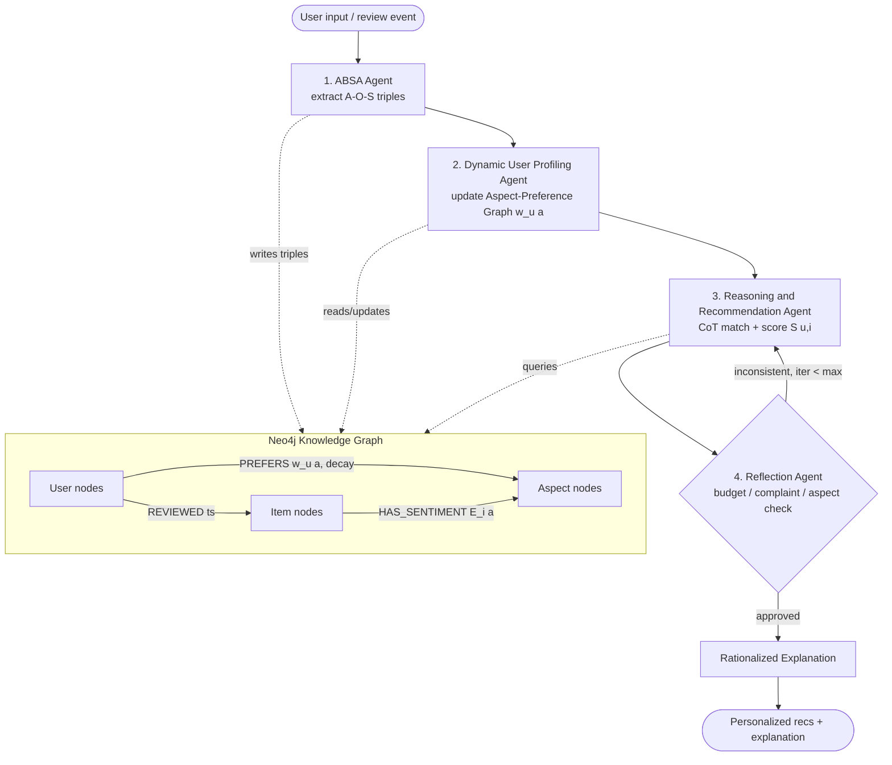

# feat: EmoRecAgent — Multi-Agent Affective Recommendation Framework

## Summary

EmoRecAgent is a four-agent system orchestrated with **LangGraph** over a **local LLM (Qwen2.5-Instruct via Ollama)** that turns raw product reviews into emotion-aware, explainable recommendations. The pipeline is: **ABSA Agent** (extract Aspect–Opinion–Sentiment triples) → **Dynamic User Profiling Agent** (maintain a time-decayed Aspect-Preference Graph in Neo4j) → **Reasoning & Recommendation Agent** (Chain-of-Thought matching) → **Reflection Agent** (self-check against budget/prior complaints, request a redo if inconsistent).

The two contributions that carry the Q1 novelty are implemented as first-class, measurable components:

1. **Dynamic Preference Shifting** — a scoring function S(u,i) that blends a collaborative-filtering base with a time-decayed, aspect-weighted sentiment term, plus a concrete online weight-update rule for w_u(a) so a fresh complaint immediately reshapes future rankings.
2. **Rationalized Explanations** — recommendations come with evidence-grounded natural-language justifications, evaluated for faithfulness (evidence coverage + sentiment agreement), not just plausibility.

Evaluation uses **Amazon Reviews 2023 / Beauty_and_Personal_Care** with a standard RecSys protocol (5-core filtering, chronological leave-last-out split, Recall/NDCG/HR/MRR@K) plus an explanation-faithfulness track and ablations (no-reflection, no-dynamic-weights, base-CF-only).

**Target repo:** this repository (`EmoRecAgent`). All paths below are repo-relative.

---

## Problem Frame

Single-LLM recommenders are slow, hallucination-prone, and produce post-hoc explanations whose faithfulness to the actual scoring is unverifiable. They also treat user preference as static, ignoring that a recent bad experience ("the old earbuds hurt my ears") should sharply elevate an aspect ("comfort") for the next recommendation.

EmoRecAgent addresses three gaps:

- **Fine-grained affect**: extract structured (aspect, opinion, sentiment) triples instead of a single review-level polarity.
- **Temporal preference dynamics**: model preference as a time-decayed function of past affective signals, so recent emotions dominate.
- **Verifiable, self-corrected output**: a reflection loop checks each recommendation against the user's constraints and review history before it is shown, and explanations are grounded in extracted evidence.

This is a research/experimentation system: the deliverable is a reproducible offline pipeline + evaluation harness suitable for an SCI (Q1) paper, not a production service.

---

## Requirements

| ID | Requirement |
| --- | --- |
| R1 | Stream-ingest the Beauty_and_Personal_Care review + meta JSONL, apply iterative 5-core filtering, and produce a chronological leave-last-out train/valid/test split. |
| R2 | ABSA Agent extracts (aspect, opinion, sentiment) triples from review text via a local LLM (with a confidence score attached as metadata; "triple" refers to the aspect–opinion–sentiment core throughout), using a modular extract→validate (LLM-as-judge) decomposition, with on-disk caching keyed by review id. |
| R3 | Aggregate per-item aspect sentiment E_i(a) and persist a knowledge graph (Neo4j) of User, Item, Aspect nodes with sentiment-weighted, timestamped edges. |
| R4 | Dynamic User Profiling Agent maintains a per-user Aspect-Preference Graph with a time-decayed, normalized weight w_u(a) and an online update rule triggered by new ABSA signals. |
| R5 | Implement the Dynamic Preference Shifting score S(u,i) combining a CF base S_base and the aspect-weighted, time-decayed sentiment term. |
| R6 | Reasoning & Recommendation Agent produces a ranked candidate list using Chain-of-Thought over the user's top aspects and the item KG. |
| R7 | Reflection Agent validates each recommendation set against explicit constraints (budget/price, prior complaints, aspect consistency) and triggers a bounded re-recommendation loop on failure. |
| R8 | Generate Rationalized Explanations grounded in extracted aspects/evidence (e.g., "you valued battery but disliked weight; this item matches battery and is 20% lighter per 95% of reviewers"). |
| R9 | Orchestrate all four agents as a LangGraph StateGraph with shared typed state, conditional reflection edges, and a recursion/iteration cap. |
| R10 | Provide baselines: most-popular, ItemKNN/CF, matrix-factorization (SVD), and a non-reflective single-LLM ablation. |
| R11 | Evaluation harness computes Recall@K, NDCG@K, HR@K, MRR@K and explanation-faithfulness metrics (evidence coverage, sentiment agreement, ROUGE-L), with a config-driven experiment runner and ablation switches. |
| R12 | Full reproducibility: pinned dependencies, seed control, YAML experiment configs, Dockerized Neo4j, logged results, and a paper-oriented README. |
| R13 | Measure and report ABSA triple quality (precision/recall/F1) against a hand-labeled gold subset, so downstream gains are attributable. |
| R14 | Demonstrate the dynamic-preference contribution *directly* via a shift-subpopulation analysis and a counterfactual complaint-injection probe, with a global temporal cutoff (no leakage) and paired significance testing on all reported deltas. |

---

## High-Level Technical Design

### Agent topology (LangGraph)



The four agents are nodes in a single `StateGraph`. Shared state is a typed dict carrying: the active user id, current ABSA triples, the user's top-aspect weight vector, the candidate recommendation list with per-item score breakdowns, the reflection verdict, and an iteration counter. The only cycle is REC ⇄ REF, gated by a `max_reflection_iters` cap to guarantee termination.

### Contribution 1 — Dynamic Preference Shifting

Recommendation score for user u and item i, evaluated at the user's query time t:

```
S(u, i) = α · S_base(u, i) + (1 − α) · Σ(a ∈ A_u) [ w_u(a, t) · Ê_i(a) ]
```

**Time decay lives in exactly one place — the weight w_u(a, t).** This resolves the earlier double-counting: there is no separate outer e^(−λΔt) term, and Ê_i(a) is *not* recency-weighted (decay is a property of the user's evolving preference, not of the item's intrinsic quality).

- **S_base(u, i)** — collaborative-filtering similarity (matrix factorization / ItemKNN over the **train split**, read from the split files — not via Cypher), min-max normalized to [0, 1].
- **w_u(a, t)** — user u's dynamic, time-decayed, normalized preference weight for aspect a; sums to 1 over the user's active aspects A_u, and is 0 for aspects outside A_u (so the sum index a ∈ A_u is well-defined).
- **Ê_i(a)** — item i's sentiment score on aspect a, **rescaled to [0, 1]** via (E_raw + 1)/2 where E_raw ∈ [−1, 1] is the mean ABSA polarity. Rescaling keeps both blended terms on the same [0, 1] scale so α is a clean convex interpolation. (An alternative signed design — where complaints actively push items *down* — is recorded as an Open Question; the plan ships the rescaled version by default.) Aggregation uses **helpfulness-capped** weighting (capped to avoid importing popularity/age bias — see Risks), with a strict **temporal cutoff**: only item reviews dated before the user's test timestamp contribute (prevents leakage).

**Online weight-update rule (the "shifting" mechanism).** w_u(a, t) is the renormalized, time-decayed accumulation of the user's affective interest in aspect a:

```
I_u(a, t) = Σ over u's past triples on a (t_k < t):  intensity(s_k) · e^(−λ · (t − t_k))
w_u(a, t) = I_u(a, t) / Σ(a' ∈ A_u) I_u(a', t)
```

`w_u` encodes **salience (how much the user cares about aspect a), not preference direction** — direction is supplied by Ê_i(a). `intensity(s)` is therefore largest for **strong** sentiment of **either** polarity: a fresh strong complaint about "comfort" spikes I_u(comfort) and thus w_u(comfort), pushing comfort to the top of the next ranking. The exact `intensity(·)` and `E_raw` aggregation are finalized in U6–U7, but the **structure above (single decay location, [0,1] rescale, salience semantics, temporal cutoff) is frozen** so the contribution can be claimed and the formula is unambiguously codeable.

### Contribution 2 — Rationalized Explanations

The explanation is generated from the *same* aspect evidence used in scoring (not a free-form afterthought): the top contributing aspects to S(u,i), the user's relevant prior sentiment, and item i's E_i(a) with supporting review counts. Faithfulness is then measured (U11): does the explanation cite aspects that actually drove the score, and does its stated sentiment agree with E_i(a)?

### Reflection loop (Agent 4)

Reflection runs deterministic checks first (price ≤ user budget; recommended item does not score low on an aspect the user recently complained about; aspect coverage of the user's top-k weights), then an LLM-as-judge consistency pass. A failed check returns a structured critique to the Reasoning Agent (which re-ranks with the critique as an added constraint), bounded by `max_reflection_iters`.

---

## Related Work & Positioning (novelty defense)

A Q1 reviewer will try to decompose S(u,i) into known parts. The plan must position against — and beat, on equal footing — two prior-art families:

| Family | Representative work | What it does | What it lacks (our claim) |
| --- | --- | --- | --- |
| Aspect-aware recommenders | EFM (Zhang+ 2014), TriRank (He+ 2015), ANR (Chin+ 2018), MTER | user-aspect preference × item-aspect quality, blended with CF | static aspect weights; no event-level temporal dynamics; explanations not faithfulness-verified |
| Temporal / sequential recommenders | timeSVD++ (Koren 2009), GRU4Rec, SASRec, **TiSASRec** (time-interval-aware) | model interaction order / time gaps | no fine-grained *affective* signal per aspect; no immediate single-event re-ranking from a complaint; no self-correction |

**Where the novelty actually lives** (falsifiable, not framing): EmoRecAgent's contribution is **event-level immediate preference re-ranking driven by fine-grained affect** — a *single* new review/complaint produces a measurable, directionally-correct shift in the next ranking — **coupled** with a reflection-corrected, faithfulness-verified explanation. The blend `α·S_base + (1−α)·Σ w_u·Ê_i` and exponential decay are deliberately standard *components*; the claimed novelty is (1) the affect-as-salience event-response mechanism and its measurable monotonic behavior, and (2) the end-to-end coupling of that score with verifiable explanation + self-correction. The paper must demonstrate this with a **shift-subpopulation analysis** and a **counterfactual probe** (see Experiment Design), not merely aggregate NDCG — because aggregate ranking on a single held-out item cannot, by itself, show a temporal effect.

---

## Key Technical Decisions

- **KTD1 — LangGraph for orchestration.** Use a single `StateGraph` with a typed state and an explicit REC⇄REF cycle rather than a linear chain or the prebuilt `langgraph-reflection` package. Reason: the four agents are heterogeneous (not just main+judge), and we need full control of the conditional reflection edge and iteration cap. `langgraph-reflection`'s `create_reflection_graph` is used as a reference pattern only. **`langgraph` is already installed** (it is a hard dependency of the installed `langchain 1.2.18`; `langgraph 1.1.x` resolves `StateGraph`/`START`/`END`/`add_conditional_edges`) — there is **no version-skew risk**; U1 simply pins `langchain>=1.2,<2` and `langgraph>=1.1,<2` together. Add a `recursion_limit` on `.invoke(...)` as a backstop alongside the iteration counter.

- **KTD2 — Local LLM = Qwen2.5-Instruct via Ollama.** Plan targets a CUDA GPU (the user is fixing the driver). **Pin a single model — `Qwen2.5-7B-Instruct` — for all headline-comparison results** so methods are comparable; `Qwen2.5-14B-Instruct` is used only in a dedicated model-size sensitivity result (not the main table), and `qwen2.5:3b` is the CPU-only smoke-test model. Access via `langchain-ollama` `ChatOllama` with `with_structured_output(...)`. All LLM access goes through one wrapper module so the backend is swappable.

- **KTD3 — ABSA via modular extract→judge (PASTEL-style).** Decompose triple extraction into (a) candidate aspect+opinion+polarity generation and (b) an LLM-as-judge validation/prune pass with Chain-of-Thought. This is more accurate than monolithic end-to-end extraction and gives the paper a defensible ABSA method. Triples are computed **offline and cached** — per-request LLM ABSA over millions of reviews is infeasible.

- **KTD4 — Neo4j as the knowledge graph backend (Dockerized).** Per user choice. Schema: `(:User)-[:REVIEWED {ts}]->(:Item)`, `(:Item)-[:HAS_SENTIMENT {score, n_support, ts}]->(:Aspect)`, `(:User)-[:PREFERS {weight, updated_ts}]->(:Aspect)`. Access through the official `neo4j` driver wrapped in a thin repository module (so graph logic is testable and the rest of the system never embeds raw Cypher). `langchain-neo4j` is optional for any graph-QA experiments. Requires adding `neo4j` driver + a `docker-compose.yml`.

- **KTD5 — CF base computed classically, not by the LLM.** S_base comes from matrix factorization (e.g., `implicit` ALS or a NumPy SVD) / ItemKNN over the train split. Keeps the base term fast, deterministic, and comparable to baselines; the LLM is reserved for ABSA, reasoning, reflection, and explanation.

- **KTD6 — Evaluation follows the official AmazonReviews2023 protocol.** 5-core filtering + chronological leave-last-out (latest=test, 2nd-latest=valid, rest=train), metrics Recall@K / NDCG@K / HR@K / MRR@K for K ∈ {5,10,20}. Mirrors `hyp1231/AmazonReviews2023` benchmark conventions so results are comparable and reviewer-defensible.

- **KTD7 — Sampled k-core subset for the LLM-heavy path.** Because ABSA is LLM-bound, define a reproducible sampled subset (5-core, capped users/items, fixed seed) for the agentic pipeline, while CF baselines can run on the larger 5-core set. The sampling boundary is a config value recorded in results.

- **KTD8 — Config-driven experiments.** All hyperparameters (α, λ, K, model name, sample size, max_reflection_iters, ablation flags) live in YAML configs under `configs/`; the runner records the resolved config alongside results for reproducibility.

---

## Output Structure

```
EmoRecAgent/
├── pyproject.toml / requirements.txt      # pinned deps (adds langgraph, neo4j, ...)
├── docker-compose.yml                     # Neo4j service
├── .env.example                           # NEO4J_URI, OLLAMA_HOST, model names
├── configs/
│   ├── default.yaml                       # α, λ, K, model, sample size, iters
│   └── ablations/                         # no_reflection.yaml, no_dynamic_w.yaml, base_cf.yaml
├── src/emorecagent/
│   ├── config.py                          # typed config loading
│   ├── llm/                               # Ollama wrapper + structured-output helpers + prompts
│   ├── data/                              # streaming loader, 5-core filter, leave-last-out split
│   ├── absa/                              # extract→judge ABSA pipeline + triple cache
│   ├── kg/                                # Neo4j repository, schema, loaders
│   ├── scoring/                           # S_base (CF), E_i aggregation, dynamic weights, S(u,i)
│   ├── agents/                            # absa_agent, profiling_agent, reasoning_agent, reflection_agent
│   ├── graph/                             # LangGraph state + StateGraph wiring
│   ├── explain/                           # rationalized explanation generation
│   ├── baselines/                         # popularity, itemknn, svd, llm_no_reflect
│   └── eval/                              # metrics, faithfulness, experiment runner
├── scripts/
│   ├── download_amazon_reviews.py         # (exists) dataset download
│   ├── build_dataset.py                   # run filter + split
│   ├── run_absa.py                        # offline triple extraction → cache + KG
│   └── run_experiment.py                  # end-to-end experiment from a config
├── tests/                                 # unit + integration tests mirroring src/
└── docs/plans/                            # this plan
```

The per-unit Files sections are authoritative; the tree is the intended shape and may be adjusted during implementation.

---

## Implementation Units

Phased: **A. Foundation** (U1–U3) → **B. Affective core** (U4–U7) → **C. Agents & orchestration** (U8–U10) → **D. Evaluation & reproducibility** (U11–U13).

### U1. Project scaffolding, dependencies, and infrastructure

- **Goal**: Establish the package layout, pinned dependencies, Dockerized Neo4j, env config, and git, so every later unit has a home.
- **Requirements**: R12
- **Dependencies**: none
- **Files**: `pyproject.toml`, `requirements.txt`, `docker-compose.yml`, `.env.example`, `src/emorecagent/__init__.py`, `src/emorecagent/config.py`, `configs/default.yaml`, `.gitignore`, `tests/test_config.py`
- **Approach**: Pin `langchain>=1.2,<2` and `langgraph>=1.1,<2` **together** (both already installed — langgraph is a langchain dependency); add `neo4j`, `numpy`, `pandas`, `scikit-learn`, `rouge-score`, `pydantic`, `pyyaml`, `python-dotenv`, `tqdm`. **One CF backend only** (scikit-learn / NumPy SVD) — do *not* add `implicit` (native-build burden, redundant). **Drop `langchain-neo4j`** until a concrete graph-QA experiment needs it (the official `neo4j` driver covers all planned use). `docker-compose.yml` runs Neo4j 5 with auth from `.env`. `config.py` loads YAML + env into a typed Pydantic settings object. `git init` and a `.gitignore` that excludes `data/`, caches, and `.env`. Add a runtime-bring-up check (Ollama daemon reachable + target model pulled) so U3/U4 have a defined predecessor.
- **Patterns to follow**: existing `scripts/download_amazon_reviews.py` CLI/style; existing `requirements.txt`.
- **Test scenarios**: config loads `default.yaml` and overlays env; missing required env raises a clear error; unknown config key is rejected. `Covers R12.`
- **Verification**: `docker compose up` starts Neo4j and the browser is reachable; `ollama serve` is reachable and `ollama pull qwen2.5:7b` (and `:3b`) succeeds; `python -c "from emorecagent.config import load_config; load_config()"` returns a populated config.

### U2. Data ingestion, 5-core filtering, and chronological split

- **Goal**: Turn the raw 11 GB review JSONL + 2.7 GB meta into a clean, 5-core, time-split dataset plus an item-metadata table.
- **Requirements**: R1
- **Dependencies**: U1
- **Files**: `src/emorecagent/data/loader.py`, `src/emorecagent/data/kcore.py`, `src/emorecagent/data/split.py`, `scripts/build_dataset.py`, `tests/data/test_kcore.py`, `tests/data/test_split.py`
- **Approach**: Stream the JSONL line-by-line (never load 11 GB into memory). Keep needed review fields (`user_id`, `parent_asin`, `rating`, `text`, `timestamp`, `helpful_vote`, `verified_purchase`); de-duplicate repeated (user,item) keeping earliest. Iterative 5-core pruning until stable. Chronological leave-last-out per user (latest=test, 2nd=valid, rest=train). Load meta into a compact parquet/table keyed by `parent_asin` (title, price, categories, features, details). Apply the **KTD7** sample cap for the agentic subset (cap value from `configs/default.yaml`); enforce a **minimum-history threshold** (≥ H prior train reviews spanning ≥ 2 aspects) for users entering the agentic test set, since the dynamic-weight effect cannot exist for near-cold users — record H and the resulting test-user count in the manifest. Write split files + a manifest recording counts, the seed, and the global temporal cutoff timestamps.
- **Patterns to follow**: streaming approach over the existing download script; AmazonReviews2023 benchmark preprocessing conventions.
- **Test scenarios**: 5-core on a tiny fixture leaves only users/items with ≥5 interactions after convergence; duplicate (user,item) collapses to earliest timestamp; leave-last-out assigns exactly one test and one valid interaction per eligible user and never leaks a test interaction into train; users with <3 interactions are excluded from valid/test. `Covers R1.`
- **Verification**: running `build_dataset.py` on the real file produces train/valid/test with a manifest; counts are logged and stable across reruns with a fixed seed.

### U3. Local LLM wrapper, structured output, and prompt infrastructure

- **Goal**: One swappable interface to the local LLM with reliable structured output and centralized prompts.
- **Requirements**: R2 (enabler for R6–R8)
- **Dependencies**: U1
- **Files**: `src/emorecagent/llm/client.py`, `src/emorecagent/llm/schemas.py`, `src/emorecagent/llm/prompts.py`, `tests/llm/test_client.py`
- **Approach**: Wrap `ChatOllama` with model name/host from config, deterministic settings (temperature, seed) for reproducibility, timeout + retry with backoff, and a `with_structured_output` helper bound to Pydantic schemas (e.g., `TripleSet`). Prompts (ABSA extract, ABSA judge, reasoning CoT, reflection judge, explanation) live as versioned templates. Provide a `FakeLLM` test double so downstream units test without a running model.
- **Patterns to follow**: `langchain-ollama` `ChatOllama` + `with_structured_output`; PASTEL-style prompt decomposition from research.
- **Test scenarios**: structured-output helper parses valid JSON into the Pydantic schema; malformed model output triggers a bounded retry then a typed error; `FakeLLM` returns scripted responses; deterministic config is passed through to the client. `Covers R2.`
- **Verification**: with Ollama up and `qwen2.5` pulled, a sample review returns a parsed `TripleSet`; with `FakeLLM`, tests pass offline.

### U4. ABSA Agent — offline triple extraction (extract → judge) with caching

- **Goal**: Extract validated (aspect, opinion, sentiment, confidence) triples from review text and cache them.
- **Requirements**: R2
- **Dependencies**: U2, U3
- **Files**: `src/emorecagent/absa/extractor.py`, `src/emorecagent/absa/judge.py`, `src/emorecagent/absa/pipeline.py`, `src/emorecagent/absa/cache.py`, `src/emorecagent/absa/quality.py`, `scripts/run_absa.py`, `data/labeled/absa_gold.jsonl` (hand-labeled), `tests/absa/test_pipeline.py`, `tests/absa/test_cache.py`
- **Approach**: Stage 1 generates candidate aspect+opinion+polarity with CoT; Stage 2 LLM-as-judge validates/prunes candidates against the source text and assigns confidence. Normalize aspect surface forms to a canonical aspect vocabulary (lowercase + lightweight synonym map seeded from frequent aspects). Cache keyed by review id (JSONL/sqlite) so reruns skip extracted reviews; `run_absa.py` processes the sampled subset with progress + resumability. **ABSA quality is a reported result, not just a risk spot-check**: `quality.py` scores extracted triples against a hand-labeled gold set (a few hundred triples in `data/labeled/absa_gold.jsonl`) and reports triple precision/recall/F1 — this number anchors the attribution of downstream gains to the contribution vs. the LLM.
- **Patterns to follow**: PASTEL / DGSEP modular decomposition (extract then validate); U3 structured output.
- **Test scenarios**: a known sentence ("battery lasts long but charging is slow") yields (battery, *, positive) and (charging, *, negative) under `FakeLLM`; judge drops a candidate unsupported by the text; aspect normalization maps "build quality"/"build" to one canonical aspect; cache hit skips re-extraction; partial run resumes without duplicating; `quality.py` computes precision/recall/F1 correctly against a tiny gold fixture. `Covers R2.`
- **Verification**: `run_absa.py` over the sampled subset writes a triple cache; re-running is near-instant (all cache hits).

### U5. Neo4j knowledge graph — schema, loaders, repository

- **Goal**: Persist users, items, aspects, interactions, and aggregated item-aspect sentiment in Neo4j behind a clean repository API.
- **Requirements**: R3
- **Dependencies**: U2, U4
- **Files**: `src/emorecagent/kg/schema.py`, `src/emorecagent/kg/repository.py`, `src/emorecagent/kg/loaders.py`, `tests/kg/test_repository.py`
- **Approach**: Create constraints/indexes on `User.id`, `Item.asin`, `Aspect.name`. Loaders write `REVIEWED {ts, rating}` edges, and aggregate triples into `(:Item)-[:HAS_SENTIMENT {score E_i(a), n_support, ts}]->(:Aspect)` where score is a helpfulness/recency-weighted mean polarity. Repository module exposes typed methods (`upsert_item_sentiment`, `get_item_aspects`, `get_user_reviews`, `upsert_user_preference`) so no Cypher leaks elsewhere. Batch writes with `UNWIND`.
- **Patterns to follow**: official `neo4j` driver sessions; repository pattern.
- **Test scenarios**: schema setup is idempotent (re-running creates no duplicate constraints); loading a fixture creates expected node/edge counts; E_i aggregation weights higher-helpfulness reviews more; querying an item returns its aspect-sentiment map. Integration: triples from U4 load and are retrievable by the repository. `Covers R3.`
- **Verification**: against the Docker Neo4j, fixture load + queries return expected results; Neo4j browser shows the tri-partite graph.

### U6. Dynamic User Profiling Agent — time-decayed Aspect-Preference Graph

- **Goal**: Maintain and update per-user aspect weights w_u(a) with the time-decay + renormalization rule.
- **Requirements**: R4
- **Dependencies**: U5
- **Files**: `src/emorecagent/scoring/dynamic_weights.py`, `src/emorecagent/agents/profiling_agent.py`, `tests/scoring/test_dynamic_weights.py`
- **Approach**: Implement I_u(a,t) = Σ intensity(s_k)·e^(−λ(t−t_k)) over the user's triples on aspect a, then normalize to w_u(a,t). `intensity(s)` peaks for strong sentiment of either polarity (so a strong complaint elevates the aspect). The agent reads the user's triples/edges from the KG, computes the weight vector at the query timestamp, writes `PREFERS {weight, updated_ts}` edges back, and returns the top-k aspects into graph state. Pure-function core (numeric) is separated from KG I/O for testability.
- **Patterns to follow**: U5 repository for I/O; the formula in High-Level Technical Design.
- **Test scenarios**: a recent strong negative signal on "comfort" produces a higher w_u(comfort) than an older positive signal on another aspect; weights sum to 1 over active aspects; larger λ makes old signals decay faster (monotonic check); a user with a single aspect gets weight 1.0; **empty history returns an empty profile** (A_u = ∅, so the affective term contributes nothing and S falls back to α·S_base — the explicit policy, not a uniform prior). `Covers R4.`
- **Verification**: feeding the motivating example (old complaint about ear pain) yields "comfort/design" as the top aspect for the next query.

### U7. Scoring model — CF base + Dynamic Preference Shifting S(u,i)

- **Goal**: Implement S_base, E_i(a) usage, and the full S(u,i) blend with time decay.
- **Requirements**: R5
- **Dependencies**: U5, U6
- **Files**: `src/emorecagent/scoring/cf_base.py`, `src/emorecagent/scoring/sentiment_agg.py`, `src/emorecagent/scoring/score.py`, `tests/scoring/test_score.py`
- **Approach**: `cf_base.py` builds S_base from the **train-split interaction files** (matrix factorization / ItemKNN — the interaction matrix is read from parquet, never pulled through Cypher), min-max normalized to [0,1]. `sentiment_agg.py` exposes Ê_i(a) ∈ [0,1] from the KG with the temporal cutoff applied. `score.py` computes S(u,i) = α·S_base + (1−α)·Σ_a w_u(a,t)·Ê_i(a) (single decay location, per the frozen HLD formula), vectorized over candidate items, returning a per-item score breakdown with each aspect's contribution (feeds U10's explanation and U12's perturbation-faithfulness test). **Empty-overlap policy**: when a candidate item has no triples on the user's active aspects, define behavior explicitly — default is to restrict the candidate pool (U8) to items with ≥ k aspect edges; for any residual, the affective term is 0 and S falls back to α·S_base (recorded, not silent). α and λ from config.
- **Patterns to follow**: classic MF/ItemKNN; the frozen formula in High-Level Technical Design; U6 weights.
- **Test scenarios**: α=1 reduces S to pure S_base; α=0 reduces to the affective term; increasing w_u(a) for an aspect where Ê_i(a) is high raises that item's rank; a more recent triple (smaller t−t_k) raises w_u(a) and thus that aspect's contribution; an item with no aspect overlap scores exactly α·S_base; score breakdown components sum to the reported S. `Covers R5.`
- **Verification**: on a small fixture, ranking by S differs from ranking by S_base alone in the expected direction when a user has a strong recent aspect preference.

### U8. Reasoning & Recommendation Agent — Chain-of-Thought matching

- **Goal**: Produce a ranked, explained candidate list by reasoning over the user's top aspects and the item KG.
- **Requirements**: R6
- **Dependencies**: U7
- **Files**: `src/emorecagent/agents/reasoning_agent.py`, `tests/agents/test_reasoning_agent.py`
- **Approach**: Retrieve a candidate pool (CF top-N ∪ items strong on the user's top aspects from the KG) to keep the LLM context small, score the pool with U7, and run a CoT pass that explains the match of the top candidates to the user's preference structure. Accepts an optional reflection critique that adds a hard constraint (e.g., "exclude items over budget", "require high comfort") and re-ranks. Returns candidates with score breakdowns into graph state.
- **Patterns to follow**: U3 prompts (CoT); U7 scoring; candidate-generation-then-rerank.
- **Test scenarios**: candidate pool includes both CF and aspect-strong items; final ranking respects S; a passed critique constraint removes/penalizes violating items on the next call; with `FakeLLM` the CoT step is exercised deterministically. `Covers R6.`
- **Verification**: given a profiled user, the agent returns a top-K list whose ordering matches S and whose rationale references the user's top aspects.

### U9. Reflection Agent + LangGraph orchestration

- **Goal**: Wire all four agents into one LangGraph StateGraph with a bounded reflection loop.
- **Requirements**: R7, R9
- **Dependencies**: U4, U6, U8
- **Files**: `src/emorecagent/graph/state.py`, `src/emorecagent/graph/build.py`, `src/emorecagent/agents/reflection_agent.py`, `tests/graph/test_reflection.py`, `tests/graph/test_pipeline.py`
- **Approach**: `state.py` defines the typed shared state (user id, triples, weight vector, candidates+breakdowns, reflection verdict, iter count). The in-graph **ABSA node loads precomputed/cached triples (from U4)** for the offline-evaluated path — it does *not* re-run LLM extraction per request; live extraction is reserved for the single-review interactive demo only. `reflection_agent.py` runs deterministic checks then an LLM-as-judge consistency pass; on failure it emits a structured critique. The **budget check is conditional on price availability** — Amazon meta `price` is frequently null, so a null price skips the hard budget gate and falls back to the item's category price-percentile (never a silent pass/fail). Other deterministic checks: no recommended item scores low on a recently-complained aspect; top-k aspect coverage. The **user budget source** is an explicit field on the request/user config (not inferred). `build.py` assembles nodes ABSA→Profiling→Reasoning→Reflection, then a conditional edge: Reflection→Reasoning if `not approved and iter < max_reflection_iters`, else →**Explanation→END** (the Explanation node from U10 is the terminal graph node). Reference pattern: `create_reflection_graph`, implemented explicitly for this topology.
- **Patterns to follow**: LangGraph `StateGraph`, `add_conditional_edges`, `START`/`END`; research reflection loop.
- **Test scenarios**: an over-budget recommendation (with known price) is rejected and the loop re-invokes Reasoning with the budget constraint; a null-price item skips the hard gate and uses the percentile fallback; the loop terminates at `max_reflection_iters` even if never approved (no infinite cycle); an approved set flows to the Explanation node then END; state mutations accumulate correctly across the cycle; integration: full ABSA(cache)→…→Reflection→Explanation run on a fixture yields an approved, constraint-satisfying list with an explanation. `Covers R7. Covers R9.`
- **Verification**: invoking the compiled graph on a sample user returns an approved recommendation set; a forced inconsistency triggers exactly the expected number of re-tries.

### U10. Rationalized Explanation generation

- **Goal**: Produce evidence-grounded explanations tied to the actual score drivers.
- **Requirements**: R8
- **Dependencies**: U7, U9
- **Files**: `src/emorecagent/explain/rationalize.py`, `tests/explain/test_rationalize.py`
- **Approach**: From the top item's score breakdown, take the highest-contributing aspects, the user's relevant prior sentiment, and item Ê_i(a) with `n_support`; generate a templated-then-LLM-polished explanation citing concrete **aspects and review-support counts** (e.g., "you cared about comfort after a recent issue; this item rates positively on comfort across 95% of N supporting reviews"). **Ground claims only in fields that reliably exist** — aspect sentiment, support counts, and the user's prior triples — **not** structured numeric specs like price or weight/"20% lighter", which are frequently null in the Amazon meta; any such numeric claim is allowed only when the value is actually present (e.g., parsed from `features`/`details`) and is otherwise omitted. Emit a structured explanation object (claims + cited aspects + contribution magnitudes + support) so U12 can score faithfulness, including the per-aspect contribution magnitude (not just presence) for the perturbation test.
- **Patterns to follow**: U3 prompts; review-grounded explanation literature.
- **Test scenarios**: explanation cites only aspects present in the score breakdown (no invented aspects); stated polarity per aspect agrees with Ê_i(a); support counts come from KG `n_support`; a numeric spec is included only when present in meta and omitted when null; structured object carries per-aspect contribution magnitude and round-trips for faithfulness scoring. `Covers R8.`
- **Verification**: generated explanations for sample recs reference the true top *score-driving* aspects, contain no aspect absent from the breakdown, and make no numeric claim about a field that is null.

### U11. Baselines (CF, aspect-aware, sequential)

- **Goal**: Implement the comparison methods a Q1 reviewer expects — including the two families that directly contest our claims.
- **Requirements**: R10
- **Dependencies**: U2, U7, U8, U10 (the LLM baseline reuses Reasoning + Explanation)
- **Files**: `src/emorecagent/baselines/popularity.py`, `src/emorecagent/baselines/itemknn.py`, `src/emorecagent/baselines/svd.py`, `src/emorecagent/baselines/aspect_aware.py`, `src/emorecagent/baselines/sequential.py`, `tests/baselines/test_baselines.py`
- **Approach**: Common `recommend(user, k)` interface. **Standard**: Popularity (global top-N), ItemKNN, SVD/MF. **Aspect-aware** (`aspect_aware.py`): an EFM/TriRank-style static-aspect recommender fed the **same ABSA Ê_i(a)** — this isolates *our dynamic mechanism* from "aspects help at all" (the LLM's contribution). **Sequential** (`sequential.py`): at least one order-aware baseline (SASRec, and ideally TiSASRec for time-interval awareness) — this defends the *temporal* claim against a model that already exploits interaction order. Note: the "no reflection / no dynamic weights" conditions are **ablations of our own system** and live in U12 as config toggles, not as separate baseline classes here (resolves the prior baseline/ablation conflation).
- **Patterns to follow**: U7 CF utilities; EFM/TriRank for aspect-aware; SASRec/TiSASRec for sequential; shared recommender interface.
- **Test scenarios**: each baseline returns exactly k items, none from the user's train set; popularity is user-independent; ItemKNN/SVD beat random on a fixture; the aspect-aware baseline consumes the same Ê_i(a) inputs as the full system; the sequential baseline respects interaction order on a fixture. `Covers R10.`
- **Verification**: all baselines run through the eval harness and produce metric numbers comparable to the full system on the identical agentic subset.

### U12. Evaluation harness — ranking, claim-specific eval, faithfulness, significance, ablations

- **Goal**: Measure ranking quality **and prove the temporal contribution specifically**, with non-circular faithfulness and statistical rigor.
- **Requirements**: R11, R13, R14
- **Dependencies**: U9, U10, U11
- **Files**: `src/emorecagent/eval/metrics.py`, `src/emorecagent/eval/significance.py`, `src/emorecagent/eval/shift_eval.py`, `src/emorecagent/eval/faithfulness.py`, `src/emorecagent/eval/runner.py`, `configs/ablations/*.yaml`, `scripts/run_experiment.py`, `tests/eval/test_metrics.py`, `tests/eval/test_significance.py`, `tests/eval/test_faithfulness.py`
- **Approach**:
  - **Ranking metrics** (`metrics.py`): Recall@K, NDCG@K, HR@K, MRR@K, validated against hand-computed cases.
  - **Claim-specific evaluation** (`shift_eval.py`) — *the headline evidence*, because aggregate ranking on one held-out item cannot show a temporal effect: (a) **shift-subpopulation analysis** — pre-register the users whose recent reviews introduce a strong complaint on a previously non-salient aspect, and report dynamic-vs-static lift on *them*; (b) **counterfactual probe** — inject a synthetic recent complaint and verify the ranking shifts toward that aspect (a measured result, not just a unit test); optionally a leave-N-last / sliding-window sequential eval.
  - **Significance** (`significance.py`): paired bootstrap / paired t-test over per-user scores + multi-seed variance, so ablation/baseline deltas are defensible.
  - **Faithfulness** (`faithfulness.py`) — **non-circular**: a **perturbation (ERASER-style comprehensiveness/sufficiency) test** — zero out a cited aspect's contribution and confirm the item's rank actually drops — plus an **unfaithful control** (post-hoc free-form or shuffled-aspect explanation) to prove the metric discriminates. Evidence coverage / sentiment agreement are kept as descriptive secondary checks. **ROUGE-L is dropped as a faithfulness claim** (lexical overlap is not faithfulness); retained only, if at all, as a grounding/fluency descriptor.
  - **Factorial ablations**: a `{±reflection} × {±dynamic-weights} × {±aspect-term}` grid (configs under `configs/ablations/`) so each contribution is attributed cleanly; `base_cf` (α=1) is one corner.
  - `runner.py` loads a config, builds the selected method, applies the temporal cutoff, runs over the test split, and writes results JSON + summary table + significance annotations.
- **Patterns to follow**: AmazonReviews2023 metric conventions; ERASER faithfulness; KTD8 config-driven runs.
- **Test scenarios**: NDCG@K / Recall@K match hand-computed values; HR@K is 1 iff the held-out item is in top-K; MRR matches by hand; paired bootstrap returns a correct p-value on a synthetic delta; shift-subpopulation selection picks exactly the users with a new salient-aspect complaint; the counterfactual probe moves an aspect-matching item up after injecting a complaint; the perturbation test drops rank when a true driver is removed and the unfaithful control scores low; runner reproduces identical numbers across reruns with a fixed seed. `Covers R11. Covers R13. Covers R14.`
- **Verification**: `run_experiment.py --config configs/default.yaml`, each factorial-ablation corner, and the baselines (incl. aspect-aware + sequential) produce a comparable, significance-annotated table; the shift-subpopulation and counterfactual results demonstrate the dynamic contribution directly.

### U13. Reproducibility & paper scaffolding

- **Goal**: Make every result reproducible and documented for the paper.
- **Requirements**: R12
- **Dependencies**: U12
- **Files**: `README.md`, `docs/EXPERIMENTS.md`, `src/emorecagent/utils/seeding.py`, `src/emorecagent/utils/logging.py`, `Makefile`
- **Approach**: Central seeding (Python/NumPy and LLM determinism settings); structured run logging with the resolved config + dataset manifest hash saved next to results; `Makefile` targets (`data`, `absa`, `experiment`, `ablations`); README with environment setup (Ollama model pull, `docker compose up`), exact commands to reproduce each table, and a hardware/runtime note. `EXPERIMENTS.md` documents the protocol (5-core, leave-last-out, K values, α/λ sweeps) and metric definitions.
- **Patterns to follow**: KTD6/KTD8; existing script CLI style.
- **Test scenarios**: none — documentation and orchestration only. `Test expectation: none -- docs, seeding, and Make targets; covered indirectly by U12 reproducibility tests.`
- **Verification**: a clean checkout following README reproduces the headline metric table within seed tolerance.

---

## Experiment Design (for the paper)

- **Dataset**: Amazon Reviews 2023, `Beauty_and_Personal_Care` (reviews + meta, already downloaded).
- **Preprocessing**: iterative 5-core filtering; de-duplicate (user,item) keeping earliest; chronological leave-last-out split (latest=test, 2nd=valid, rest=train). **Global temporal cutoff** applied to ABSA aggregation and CF base so no post-test information leaks.
- **Agentic subset (KTD7)**: a seeded 5-core sample (capped users/items in `configs/default.yaml`) with a **minimum-history threshold** (≥ H prior reviews spanning ≥ 2 aspects) so the temporal effect can exist; report the resulting test-user count and a power estimate. All methods are compared on the **identical** subset (so do not claim comparability to published leaderboards that use a different split).
- **Ranking metrics**: Recall@K, NDCG@K, HR@K, MRR@K for K ∈ {5, 10, 20}, with paired-bootstrap significance + multi-seed variance.
- **Claim-specific evidence (the headline)**: shift-subpopulation lift (dynamic vs static on users with a new salient-aspect complaint) and a counterfactual complaint-injection probe; optionally leave-N-last sequential eval.
- **Explanation faithfulness**: ERASER-style perturbation (comprehensiveness/sufficiency) + an unfaithful control; evidence coverage / sentiment agreement as descriptive secondary checks. (ROUGE-L is not used as a faithfulness claim.)
- **ABSA quality**: triple precision/recall/F1 on the hand-labeled gold subset.
- **Methods compared**: Popularity, ItemKNN, SVD/MF, **aspect-aware (EFM/TriRank on identical Ê_i(a))**, **sequential (SASRec / TiSASRec)**, EmoRecAgent (full).
- **Ablations (factorial)**: `{±reflection} × {±dynamic-weights} × {±aspect-term}`, incl. base-CF (α=1) — isolates each contribution.
- **Sensitivity**: sweep α and λ (tuned on validation only; report the honest optimum even if α→1 / λ→0); report effect on NDCG@10, shift-subpopulation lift, and faithfulness.

---

## Scope Boundaries

**In scope**: the four-agent LangGraph pipeline; offline ABSA extraction + cache; Neo4j KG; dynamic preference scoring + online weight update; reasoning, reflection, and rationalized explanations; baselines; offline evaluation + faithfulness; reproducibility scaffolding — all on Beauty_and_Personal_Care.

**Non-goals (this product's identity)**: a production web service, real-time online serving, or a user-facing UI. The deliverable is a reproducible research pipeline.

### Deferred to Follow-Up Work

- Additional categories beyond Beauty (the pipeline is category-agnostic by config, but only Beauty is validated initially).
- Fine-tuning a dedicated ABSA model (PASTEL-style fine-tuned extractors) — start with prompted local LLM extraction.
- Cross-encoder/embedding evidence retrieval for explanations beyond aspect-grounding.
- A human-evaluation study of explanation quality (automatic faithfulness metrics first).
- GPU-batched / vLLM serving for faster ABSA at full-category scale.

---

## Risks & Dependencies

- **GPU driver currently broken** (`nvidia-smi` fails). Local LLM throughput depends on the fix. Mitigation: small-model + `FakeLLM` paths let all non-LLM units (data, KG, scoring, metrics) be built and tested now; ABSA at scale waits on the GPU. This is the top schedule risk.
- **ABSA cost at scale.** Millions of reviews × 2 LLM passes is infeasible without the sampled subset (KTD7) and caching (U4). Risk: subset too small to show significant deltas. Mitigation: size the sample so per-user history is rich enough for the dynamic-weight effect; record subset size in results.
- **ABSA quality / LLM hallucination.** Wrong triples corrupt E_i(a) and scoring. Mitigation: the judge stage (KTD3), confidence thresholds, and aspect-vocabulary normalization; spot-check a labeled sample for triple precision.
- **Neo4j as a new dependency.** Adds infra reviewers must reproduce. Mitigation: Dockerized with `docker-compose.yml`, repository pattern isolates Cypher, fixtures seed a tiny graph for tests.
- **LLM nondeterminism vs reproducibility.** Mitigation: fixed seeds + temperature 0 where supported; cache LLM outputs; report that ABSA is cached so eval is deterministic given the cache.
- **Evaluation may not measure the temporal claim (highest research risk).** A single held-out interaction + aggregate NDCG cannot show "a complaint reshapes future rankings." Mitigation: the U12 shift-subpopulation analysis + counterfactual probe make the claim directly; aggregate ranking is secondary. Without these, a null aggregate delta would be misread as "dynamics don't help."
- **Temporal leakage in Ê_i(a) / CF base.** Building item aspect-sentiment from reviews after the test timestamp is citable leakage. Mitigation: global temporal cutoff (U2/U7), tested for.
- **Helpfulness-weighting popularity bias.** `helpful_vote` grows with item age/popularity; weighting Ê_i by it can reintroduce the popularity bias the dynamic term should counter. Mitigation: cap/normalize helpfulness weighting and report sensitivity.
- **Sampled subset not comparable to published leaderboards.** The custom min-history subset differs from standard splits. Mitigation: run all methods on the identical subset and state this explicitly rather than claiming leaderboard comparability.
- **Dependency additions**: `neo4j`, `scikit-learn`, `rouge-score` are not yet installed (U1 adds them). `langgraph` and `langchain-ollama` are **already installed** (langgraph ships with langchain 1.2) — no version-skew risk; U1 just pins the co-release.

---

## Sources & Research

- **LangGraph reflection pattern** — `langchain-ai/langgraph-reflection` (`create_reflection_graph`, `StateGraph`/`MessagesState`, conditional loop until judge approves). Used as the reference for U9's explicit 4-node loop.
- **ABSA / ASTE** — PASTEL (Findings of ACL 2025): modular extract→Cartesian-candidate→LLM-as-judge with CoT; DGSEP dual-stage generative ASTE. Grounds KTD3 / U4.
- **RecSys offline evaluation** — `hyp1231/AmazonReviews2023` benchmark scripts (5-core + chronological leave-last-out; Recall/NDCG/HR); "A Revisiting Study of Appropriate Offline Evaluation for Top-N Recommendation" (metric definitions). Grounds KTD6 / U2 / U12.
- **Explainable, review-grounded recommendation** — RGXRec / faithfulness evaluation on Amazon Beauty (evidence coverage, sentiment agreement). Grounds U10 / U12 faithfulness track.
- **Aspect-aware recommenders (baselines + novelty positioning)** — EFM (Zhang+ SIGIR 2014), TriRank (He+ CIKM 2015), ANR (Chin+ CIKM 2018). Grounds U11 aspect-aware baseline and the Related Work table.
- **Temporal / sequential recommenders (baselines)** — timeSVD++ (Koren 2009), SASRec, TiSASRec (time-interval-aware self-attention). Grounds U11 sequential baseline and defends the temporal claim.
- **Faithfulness evaluation** — ERASER (comprehensiveness/sufficiency), and the factual-consistency literature (QAGS/FactCC) on why n-gram overlap is not faithfulness. Grounds U12's perturbation faithfulness test.
- **Offline-evaluation leakage** — critical-study literature on data leakage in RecSys offline evaluation (motivates the global temporal cutoff).
- **Local context** — data verified present (`data/amazon-reviews-2023/raw/.../Beauty_and_Personal_Care.jsonl`, 11 GB; meta 2.7 GB); `langchain 1.2.18` + `langchain-ollama` installed; `langgraph`/`neo4j` not installed; `ollama` binary present (no model pulled); `nvidia-smi` failing.

