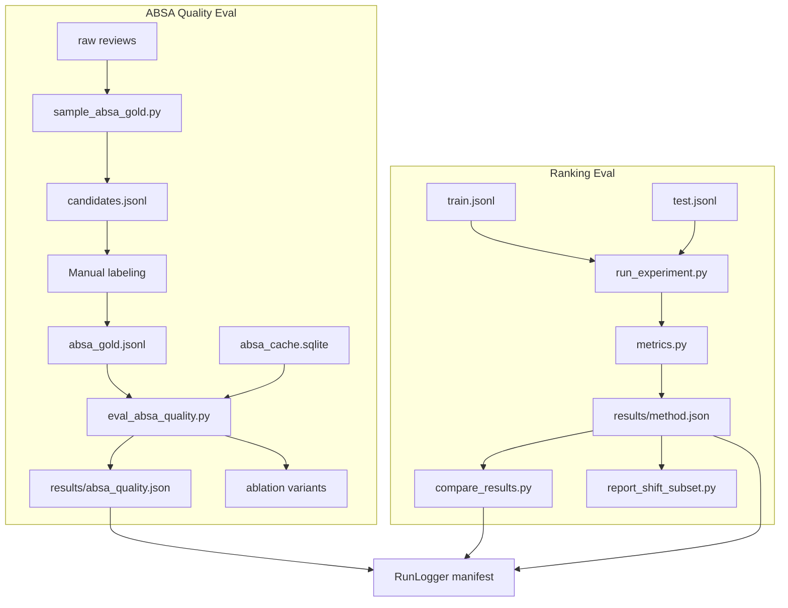

# feat: Evaluation Metrics — HR@K, NDCG@K, ABSA Macro-F1

## Summary

Formalize and document international top-K ranking metrics (HR@K, **AvgHR@1,3,5**, NDCG@K), add a reproducible **ABSA quality track** (gold n=500–1000, Macro-F1, per-aspect/per-sentiment breakdown, error taxonomy), and wire **paper-grade reporting**: user-mean aggregation, paired significance, bootstrap CIs, cumulative-history eval mode, shift-subpopulation hooks, and a unified results manifest. Scope is metrics + reporting — not reimplementing agents or shift/faithfulness cores (those modules already exist in U12).

---

## Fundamental Principle — International Standard Formulas Only

> **Lưu ý quan trọng:** Mọi metric trong EmoRecAgent **bắt buộc** được tính theo **công thức chuẩn mực quốc tế** đã được công bố trong tài liệu học thuật và thư viện tham chiếu (IR / RecSys / NLP). Không được dùng biến thể tùy ý, shortcut ngầm, hay định nghĩa “tương đương” mà không trích dẫn nguồn.

This is a **non-negotiable constraint** for code, tests, and paper text:

1. **Implement the published formula literally** — use explicit helpers (`_binary_gain`, `_dcg`, `_idcg`, `_precision`, `_recall`, `_f1`) whose docstrings cite the canonical definition.
2. **No silent deviations** — e.g. NDCG must use \(\log_2(i+1)\) in the denominator and gain \(2^{rel_i}-1\); MRR uses reciprocal of **first** relevant rank; F1 uses harmonic mean of precision and recall with standard TP/FP/FN on sets.
3. **Aggregation ≠ redefinition** — row-mean vs user-mean, bootstrap CI, and shift-subpopulation slicing are **reporting protocols** applied *after* per-instance metrics are computed correctly; they do not change the underlying metric definition.
4. **Regression tests are golden vectors** — every metric function must have hand-computed fixtures traced to a cited formula (not “looks right” smoke tests).
5. **`docs/EXPERIMENTS.md` is the contract** — each metric section lists formula, citation, edge-case rules, and points to `metrics.py` / `quality.py` implementation.

### Canonical formula reference (implementation must match)

| Metric | Standard definition | Primary reference |
|--------|---------------------|-------------------|
| **HR@K** | \(\mathbb{1}[\exists\, i \le K : \text{rank}_i \in \mathcal{R}]\) | RecSys top-K hit rate (binary relevance) |
| **AvgHR@1,3,5** | \(\frac{1}{3}\bigl(\text{HR@1}+\text{HR@3}+\text{HR@5}\bigr)\) per instance; aggregate via row-mean / user-mean | Arithmetic mean of three standard HR@K values (common RecSys summary; each term uses HR@K above) |
| **Recall@K** | \(\|\mathcal{R} \cap \text{top-}K\| / \|\mathcal{R}\|\) | Manning, Raghavan & Schütze, *IR* |
| **NDCG@K** | \(\text{DCG@K}/\text{IDCG@K}\), \(\text{DCG@K}=\sum_{i=1}^{K}\frac{2^{rel_i}-1}{\log_2(i+1)}\) | Järvelin & Kekäläinen (2002) |
| **MRR@K** | \(1/\text{rank of first relevant in top-}K\) (else 0) | Voorhees & Harman, TREC |
| **Precision / Recall / F1** | \(P=\frac{TP}{TP+FP}\), \(R=\frac{TP}{TP+FN}\), \(F_1=\frac{2PR}{P+R}\) | Sokolova & Lapalme (2009); set-based multilabel |
| **Micro-F1** | F1 on globally pooled TP/FP/FN | Standard multilabel micro average |
| **Macro-F1 (review)** | \(\frac{1}{N}\sum_r F_1^{(r)}\) over scored reviews | Unweighted macro over instances |
| **Jaccard (QA)** | \(\|A \cap B\| / \|A \cup B\|\) on key sets | Set overlap for dual annotation |

Deviations require a new KTD entry, explicit citation of the alternate definition, and a **separate metric name** in JSON (never overwrite `ndcg@10` with a custom variant).

---

## Problem Frame

EmoRecAgent’s paper claims depend on two measurable pillars:

1. **Top-K recommendation quality** — standard RecSys metrics on the held-out test split.
2. **ABSA attribution** — proving the ABSA Agent extracts reliable `(aspect, sentiment)` signals before downstream KG/profiling gains are credited.

The codebase already implements HR@K, NDCG@K, Recall@K, and MRR@K in `src/emorecagent/eval/metrics.py` and aggregates them via `scripts/run_experiment.py`. However:

- Metric definitions in `docs/EXPERIMENTS.md` are table-level only; the **explicit DCG / IDCG formulas** requested for the paper are not documented in-repo.
- Ranking edge cases (sampled negatives, multi-test users, tie-breaking) are **implicit** in code but not specified for reproducibility.
- ABSA quality (`src/emorecagent/absa/quality.py`) supports **micro-F1** only; there is **no gold file**, **no per-aspect breakdown**, and **no CLI** to report Macro-F1 on 500–1000 labeled reviews.

This plan closes those gaps without duplicating U12’s shift/faithfulness/significance modules (deferred).

---

## Requirements

| ID | Requirement |
| --- | --- |
| R-M0 | **All metrics** (ranking + ABSA + QA overlap) **must** follow internationally standard formulas per the Fundamental Principle section; code, tests, and `EXPERIMENTS.md` cite canonical definitions; no undocumented variants. |
| R-M1 | Document and implement HR@K: 1 if any relevant item appears in top-K, else 0 (per test row; aggregate via row-mean and user-mean per KTD10). |
| R-M2 | Document and implement NDCG@K with binary relevance using \(\text{DCG@K}=\sum_{i=1}^{K}\frac{2^{rel_i}-1}{\log_2(i+1)}\), \(rel_i\in\{0,1\}\), and \(\text{NDCG@K}=\text{DCG@K}/\text{IDCG@K}\). |
| R-M3 | Keep existing Recall@K and MRR@K in the runner; report all four at K ∈ {5,10,20}. |
| R-M19 | Report **AvgHR@1,3,5** = \(\frac{1}{3}(\text{HR@1}+\text{HR@3}+\text{HR@5})\) per test row (each HR@K standard per R-M1); aggregate row-mean and user-mean; JSON key `avg_hr@1,3,5`. |
| R-M4 | Sample 500–1000 reviews (seeded, stratified where feasible) into a hand-labeling workflow; store gold as `data/labeled/absa_gold.jsonl`. |
| R-M5 | Compute **review-level Macro-F1** over `(aspect, sentiment)` pairs: per-review F1, then unweighted mean across scored gold reviews. |
| R-M6 | Also report **micro-F1** (global TP/FP/FN pool) as a secondary check. |
| R-M7 | CLI writes `results/absa_quality.json` with micro/macro P/R/F1, coverage, and per-aspect breakdown. |
| R-M8 | Update `docs/EXPERIMENTS.md` with full metric math, edge-case rules, and ABSA evaluation protocol. |
| R-M9 | **Per-aspect breakdown**: for each canonical aspect, report P/R/F1, support counts, and TP/FP/FN over pooled `(aspect, sentiment)` keys across all scored reviews. |
| R-M10 | **Per-sentiment breakdown**: macro/micro P/R/F1 for `positive`, `negative`, `neutral` classes over `(aspect, sentiment)` keys. |
| R-M11 | **Error taxonomy** on gold set: counts of sentiment-flip, spurious aspect, missed aspect; export per-review error tags for qualitative paper examples. |
| R-M12 | Ranking results JSON includes `n_test_users`, `n_test_rows`, `protocol` (`full_catalog` \| `sampled_negatives`), and optional **per-user deduplicated** means. |
| R-M13 | Paper-ready **Table templates** (ranking + ABSA) documented in `docs/EXPERIMENTS.md` with example LaTeX rows. |
| R-M14 | **Cumulative-history eval mode** (`--cumulative-history`): each test row’s train history includes that user’s prior test interactions with earlier timestamps (fixes E-R10 leakage). |
| R-M15 | **Bootstrap 95% CI** on review-level Macro-F1 and on ranking user-mean metrics (paired row resample). |
| R-M16 | **ABSA pipeline ablation on gold**: report Micro/Macro-F1 for extract-only vs extract+judge (and optional confidence threshold sweep). |
| R-M17 | **Shift-subpopulation report**: NDCG@10 user-mean on `select_shift_users()` subset vs all users (read-only script over stored signals + results). |
| R-M18 | **Unified eval manifest** per run: config hash, split manifest hash, protocol, seeds, metric JSON paths. |

---

## Key Technical Decisions

### KTD0 — Standard formulas are mandatory; convenience is secondary

All implementation units (U1–U9) inherit R-M0:

- **Ranking** (`eval/metrics.py`): each function is a direct transcription of the canonical formula table above. Refactors that improve readability (e.g. `_binary_gain`) are required when they make the standard formula visible in code.
- **ABSA** (`absa/quality.py`): precision, recall, F1, micro/macro aggregation use textbook set semantics; normalization (`normalize_aspect`) affects **matching only**, not the F1 formula itself.
- **Significance / bootstrap** (`eval/significance.py`, planned `bootstrap.py`): percentile bootstrap and paired tests follow standard resampling definitions; document `n_bootstrap` and seed.
- **Code review gate**: any PR touching metrics must include (a) formula in docstring, (b) golden-vector test, (c) `EXPERIMENTS.md` cross-reference.

### KTD1 — NDCG: refactor for formula clarity, not behavior change

For binary relevance, \(2^{rel_i}-1\) equals 1 when \(rel_i=1\) and 0 otherwise — identical to the current implementation. Refactor `ndcg_at_k()` to use an explicit `_binary_gain(rel)` helper and add docstrings citing the standard formula. **No change to aggregated experiment numbers** for binary single-relevant evaluation.

### KTD2 — ABSA match key: `(aspect, sentiment)` with shared normalization

Gold and predictions match on `(normalize_aspect(aspect), sentiment)` — opinion spans are ignored. **Both** gold loading and cache prediction paths must apply `normalize_aspect()` at eval time so human labels like `"smell"` match LLM `"scent"` (see `absa/normalize.py`). Labelers should prefer canonical names from the synonym map; eval normalizes regardless.

### KTD3 — Review-level Macro-F1 denominator

\[
\text{Macro-F1}_{\text{review}} = \frac{1}{|G_s|}\sum_{r \in G_s} F_1^{(r)}
\]

where \(G_s \subseteq G\) is the set of gold reviews **scored** (prediction present in cache). Exclusion rules:

| Case | In macro mean? | Rationale |
|------|----------------|-----------|
| Gold non-empty, pred non-empty | Yes | Standard case |
| Gold non-empty, pred empty | Yes, F1=0 | Missed extraction |
| Gold empty, pred non-empty | Yes, F1=0 | Hallucination-only review (rare in gold) |
| Gold empty, pred empty | **No** | Trivial agreement; exclude from \(G_s\) |
| Gold review missing from cache | **No** | Not scored; counted in `coverage` not macro |

### KTD4 — Per-aspect breakdown (pooled micro per aspect)

For each canonical aspect \(a\) appearing in **gold or predictions** among scored reviews:

- Build sets of `TripleKey(aspect=a, sentiment=s)` per review, pool TP/FP/FN **across reviews** for keys where `aspect==a`.
- Report per-aspect `precision`, `recall`, `f1`, `support_gold`, `support_pred`, `tp`, `fp`, `fn`.
- **Headline aspect Macro-F1** (optional summary stat): unweighted mean of per-aspect F1 over aspects with `support_gold >= min_support` (default `min_support=5` in gold pool) to avoid noisy rare aspects dominating the mean.

This is distinct from review-level macro: a review-level miss on `"comfort"` affects that review’s F1; the per-aspect table shows whether errors cluster on specific aspects (e.g., `"value"` vs `"scent"`).

### KTD5 — Gold sampling: stratified by sentiment-rich reviews

`sample_absa_gold.py` uses seeded sampling with optional **length stratification** (short/medium/long text by token quartiles) and optional restriction to train-interaction `(user, item)` pairs (`absa.gold_train_only: true`). Target `n_samples` default 750 (config range 500–1000). Output: `absa_gold_candidates.jsonl` for manual labeling.

### KTD6 — Ranking eval protocol is explicit in docs

The runner (`eval/runner.py`) defines the operational semantics:

- **One test row = one metric datapoint** (not deduplicated per user).
- **Relevant set** = `{held_out_item}` only (binary, single item).
- **Candidate pool** = all items not in train history for that user, unless `--n-negatives N` (held-out + N shuffled negatives, seed-controlled).
- **Tie-breaking** in `Recommender.rank()`: higher score first, then lexicographic `item_id`.
- **Temporal query**: agentic recommenders receive `prepare_user_query(user_id, test.timestamp)`.

Document the **multi-test-user leakage caveat**: with chronological 80/10/10, a user may have multiple test interactions; train history does not include earlier test items from the same user, so later test rows may implicitly benefit from earlier held-out items still in the candidate pool. Report `n_test_users` vs `n_test_rows` in results JSON; optional follow-up: cumulative-history eval mode.

### KTD7 — Scope boundary: no new base ranking metrics

Precision@K, MAP@K, and graded-relevance NDCG remain out of scope. **AvgHR@1,3,5** is in scope as a **derived summary** (KTD19) — not a new hit-rate definition.

### KTD19 — AvgHR@1,3,5 (average hit rate at K ∈ {1, 3, 5})

Per test instance \(i\) with ranked list and relevant set \(\mathcal{R}\):

\[
\text{AvgHR@1,3,5}^{(i)} = \frac{1}{3}\sum_{k \in \{1,3,5\}} \text{HR@}k^{(i)}
\]

where each \(\text{HR@}k^{(i)}\) is the **standard** binary hit rate (R-M1). Properties:

- **Monotonic components**: \(\text{HR@1}^{(i)} \le \text{HR@3}^{(i)} \le \text{HR@5}^{(i)}\) always.
- **Range**: \([0, 1]\); equals 1 iff relevant item is at rank 1.
- **Aggregation**: same protocols as KTD10 — `means["avg_hr@1,3,5"]` (row-mean) and `means_per_user["avg_hr@1,3,5"]` (user-mean). Bootstrap CI applies to user-mean vector.
- **Implementation**: `avg_hr_at_k_list(ranked, relevant, ks=(1,3,5))` in `metrics.py`; runner computes after per-k HR. Config `eval.hr_avg_k: [1, 3, 5]` (fixed default; not user-tunable without new metric name per R-M0).
- **Reporting**: headline column in Table 1 alongside HR@10; individual `hr@1`, `hr@3`, `hr@5` also stored in `means` (add `1` and `3` to effective k sweep for HR only, or include in `k_values`).
- **Paper name**: `AvgHR@1,3,5` or `HR̄@{1,3,5}`; JSON `avg_hr@1,3,5`.

### KTD8 — Per-sentiment breakdown (class-level)

Pool all `TripleKey` across scored reviews, then partition by `sentiment ∈ {positive, negative, neutral}`:

- **Micro per sentiment**: global TP/FP/FN within class → P/R/F1 (handles class imbalance explicitly).
- **Macro per sentiment** (headline): mean of per-review F1 computed **only on keys of that sentiment** in gold (reviews with no gold keys of that class are skipped for that class’s macro mean).

Report both in JSON under `per_sentiment`. Use neutral’s low support to flag unreliable estimates (`support_gold < 10` → mark `low_support: true` in output).

### KTD9 — ABSA error taxonomy (per review)

After alignment on normalized keys, classify each scored review:

| Tag | Condition |
|-----|-----------|
| `perfect` | pred keys == gold keys |
| `missed_aspect` | ∃ gold key not in pred (FN) |
| `spurious_aspect` | ∃ pred key not in gold (FP) |
| `sentiment_flip` | ∃ aspect `a` where `(a, s_g) ∈ gold`, `(a, s_p) ∈ pred`, `s_g ≠ s_p` (subset of FP+FN) |

A review may have multiple tags. Export `error_summary` counts + optional `error_examples.jsonl` (top 20 reviews by error count) for paper qualitative §.

### KTD10 — Ranking aggregation: row-mean vs user-mean

Default (current): **row-mean** — each test interaction contributes equally to `means["hr@10"]`, `means["avg_hr@1,3,5"]`, etc.

Also compute **user-mean** (deduplicated): for each `user_id`, average metric across that user’s test rows, then mean over users. Store both in results JSON:

```json
"means": {"hr@10": 0.42, "avg_hr@1,3,5": 0.25},
"means_per_user": {"hr@10": 0.39, "avg_hr@1,3,5": 0.23},
"n_test_rows": 2601,
"n_test_users": 412
```

Paper reports **user-mean** as primary when `n_test_rows >> n_test_users` to reduce overweighting of heavy users; row-mean in appendix for AmazonReviews2023 comparability.

### KTD11 — Gold labeling QA: pilot + dual annotation

Before full 750-label run:

1. **Pilot**: 50 reviews, single annotator, run `eval_absa_quality` on LLM preds to calibrate aspect vocabulary.
2. **Dual annotation**: 100 reviews (disjoint from pilot), two passes → `absa_gold_adjudicated.jsonl`. Report **pairwise agreement** on `(aspect, sentiment)` keys: Jaccard per review, mean Jaccard. No Cohen’s κ in v1 (sparse multi-label); Jaccard is simpler for set-valued labels.
3. **Adjudication rule**: third pass resolves disagreements; only adjudicated 100 used for agreement stat; full 750 uses single annotator with README QC.

### KTD12 — Statistical comparison hook (lightweight)

Add `scripts/compare_results.py` wrapping existing `paired_compare()` from `eval/significance.py`:

```bash
python scripts/compare_results.py \
  --a results/emorecagent.json --b results/svd.json \
  --metric ndcg@10
```

Outputs delta, p-value, 95% CI. Does not re-run experiments — consumes stored `per_user` vectors. Wire into U5 docs; full multi-method table generation stays manual or follow-up.

### KTD13 — Cumulative-history eval mode (leakage fix)

Add `evaluate(..., cumulative_history: bool = False)` and CLI flag `--cumulative-history`:

When enabled, for each test row `(u, item, t)`:

```
seen(u) = train_items[u] ∪ { prior test items for u with timestamp < t }
```

Re-rank over `all_items \ seen(u)` (same negative-sampling rules). This prevents later test rows from treating earlier held-out items as unrated candidates. **Default remains `False`** for backward compatibility; paper **primary** results use `True` once implemented.

Report both protocols in Table 1 footnote when they diverge by >0.5% absolute NDCG@10.

### KTD14 — Bootstrap CI for headline metrics

**Ranking (user-mean):** For each metric@K, resample users with replacement (`n_bootstrap=1000`, seed from config), recompute user-mean each draw → percentile CI (2.5%, 97.5%).

**ABSA (review-level macro F1):** Resample scored review ids with replacement; recompute macro_review F1 per draw.

Store in JSON:

```json
"macro_review": {"f1": 0.72, "ci_low": 0.68, "ci_high": 0.76, "n_bootstrap": 1000}
```

Use `src/emorecagent/eval/significance.py` bootstrap pattern; do not add scipy dependency beyond existing.

### KTD15 — ABSA ablation on gold (attribution sanity check)

On the gold set, score three prediction variants from cache or re-run:

| Variant | Source |
|---------|--------|
| `full` | Cached post-judge triples (production) |
| `extract_only` | Re-run extractor without judge OR separate cache column (prefer re-run flag `--skip-judge` on gold ids only) |
| `low_confidence_dropped` | Full triples with `confidence < min_confidence` removed post-hoc |

Report Macro-F1 delta `full vs extract_only` in Table 2 footnote — quantifies judge contribution. If delta < 2 pts F1, judge stage is primarily QC not signal.

### KTD16 — Paper acceptance gates (reporting checklist)

Before claiming ABSA-driven gains in prose, require:

| Gate | Threshold | Field |
|------|-----------|-------|
| Gold coverage | ≥ 95% | `coverage` |
| Review Macro-F1 | ≥ 0.55 (tune after pilot) | `macro_review.f1` |
| Dual-annotation Jaccard | ≥ 0.75 | `labeling_qa.mean_jaccard` |
| Shift-subpopulation size | ≥ 30 users | `shift_report.n_users` |
| Ranking protocol | Documented | `protocol` + `cumulative_history` bool |

Gates are **documentation thresholds** in `docs/EXPERIMENTS.md`, not CI failures — they guide interpretation.

### KTD17 — Unified eval manifest

Extend `RunLogger` (`utils/logging.py`) to write `results/<run_id>/manifest.json`:

```json
{
  "run_id": "2026-06-10_svd_seed42",
  "config_hash": "...",
  "split_manifest": "data/processed/.../manifest.json",
  "ranking": "results/svd.json",
  "absa_quality": "results/absa_quality.json",
  "compare": ["results/compare_emorec_vs_svd.json"],
  "seeds": [42],
  "protocol": {"catalog": "full", "cumulative_history": true, "k_values": [5,10,20], "hr_avg_k": [1,3,5]}
}
```

`run_id` defaults to `{date}_{method}_seed{seed}`.

### KTD18 — Shift-subpopulation thin report

`scripts/report_shift_subset.py`:

1. Load user signals from in-memory KG context or precomputed JSON export.
2. `select_shift_users()` → subset user ids.
3. Filter stored `per_user` metric vectors from a results JSON by matching test rows to users in subset (requires `user_ids` parallel array in results JSON from U1).
4. Output `results/shift_subset.json` with `ndcg@10` user-mean on subset vs complement + user counts.

Does not re-run recommender — reporting only.

---

## Edge Case Catalog

### Ranking metrics (`metrics.py` + `runner.py`)

| # | Edge case | Expected behavior | Test / doc |
|---|-----------|-------------------|------------|
| E-R1 | `relevant` empty | HR=0, NDCG=0, Recall=0, MRR=0 | existing `test_empty_relevant` |
| E-R2 | `k=0` | Reject or return 0 — **define `k >= 1` invariant** in `evaluate_ranking`; runner never passes k=0 | new test |
| E-R3 | `k > len(ranked)` | Evaluate over `ranked[:k]` (i.e., full list) | new test |
| E-R4 | Single relevant item | HR@K = Recall@K for all K where item in top-K | new test + EXPERIMENTS.md |
| E-R5 | Relevant at rank 1 | NDCG@K = 1.0 for all K ≥ 1 | new test |
| E-R6 | No relevant in top-K | NDCG=0, HR=0, MRR=0 | covered |
| E-R7 | Multiple relevant items | IDCG uses `min(|relevant|, k)` ideal positions | existing two-relevant test |
| E-R8 | Duplicate `item_id` in ranked list | Should not occur from `rank()`; if passed, **first position wins** (document as undefined input — add assert in debug or dedupe) | doc only |
| E-R9 | `--n-negatives` protocol | Held-out always included; negatives seeded; metrics computed on smaller pool | integration test in `test_runner.py` |
| E-R10 | Held-out not in CF item index | Score 0 / bottom rank; HR may be 0 | doc in EXPERIMENTS.md |
| E-R11 | Identical scores (ties) | Stable tie-break by `item_id` ascending | test on `PopularityRecommender` or mock |
| E-R20 | AvgHR@1,3,5 components | Each term uses standard `hr_at_k`; average is unweighted arithmetic mean | golden-vector test |
| E-R21 | Relevant at rank 4 | HR@1=0, HR@3=0, HR@5=1 → AvgHR@1,3,5 = 1/3 | hand-computed test |
| E-R22 | Relevant at rank 1 | HR@1=HR@3=HR@5=1 → AvgHR@1,3,5 = 1.0 | test |
| E-R23 | `ranked` shorter than 5 | HR@5 evaluated on `ranked[:5]` per E-R3; AvgHR still well-defined | test |

### ABSA quality (`quality.py` + `eval_absa_quality.py`)

| # | Edge case | Expected behavior | Test |
|---|-----------|-------------------|------|
| E-A1 | Aspect case mismatch (`Scent` vs `scent`) | Normalized to same key | test with normalize |
| E-A2 | Synonym (`smell` gold, `scent` pred) | Match after `normalize_aspect` | test |
| E-A3 | Same aspect, wrong sentiment | FP on wrong pair; FN on gold pair | test |
| E-A4 | Duplicate (aspect, sentiment) in pred | Set semantics — one TP | test |
| E-A5 | Gold aspect, empty pred review | Review F1=0; aspect FN in breakdown | test |
| E-A6 | Pred aspect, empty gold review | Review F1=0; aspect FP in breakdown | test |
| E-A7 | Both empty triples | Excluded from review macro mean | test |
| E-A8 | Gold review not in cache | Skip; `coverage < 1` | CLI test |
| E-A9 | `min_confidence` filtered pred | Cache already stores post-judge triples — no re-filter at eval | doc |
| E-A10 | Rare aspect (`support_gold < 5`) | Included in per-aspect table; excluded from headline aspect-macro mean unless config lowered | test + config |
| E-A11 | Invalid sentiment in gold JSON | Pydantic validation error on load with clear message | test |
| E-A12 | Neutral sentiment class | Treated as third class in pair key; not collapsed | test |
| E-A13 | Conflicting sentiments same aspect in gold | Both keys kept; pred matching one → partial TP | test |
| E-A14 | LLM returns duplicate aspects diff sentiment | Set keeps both pred keys; may trigger `sentiment_flip` | test |
| E-A15 | Review in gold not in raw cache | `coverage` excludes; warn with review_id list cap 10 | CLI test |
| E-A16 | All aspects below `min_support` | `macro_aspect.f1 = null`, flag `insufficient_support` | test |

### Ranking aggregation (`runner.py`)

| # | Edge case | Expected behavior | Test |
|---|-----------|-------------------|------|
| E-R12 | User with 10 test rows | Row-mean ≠ user-mean in general | test fixture |
| E-R13 | Single test row per user | Row-mean == user-mean | test |
| E-R14 | `per_user` vectors length | Equals `n_test_rows` (one entry per row) | existing runner tests |
| E-R15 | Compare two runs different n_users | `paired_compare` raises | existing significance test |
| E-R16 | `cumulative_history=True` | Prior test item in `seen(u)` for later rows | integration test |
| E-R17 | User with 1 test row | Cumulative mode identical to default | test |
| E-R18 | Bootstrap n=1 user | CI collapses to point; warn if n_users < 30 | test |
| E-R19 | `user_ids` missing in old JSON | `report_shift_subset` errors with migration hint | CLI test |

### ABSA ablation & confidence

| # | Edge case | Expected behavior | Test |
|---|-----------|-------------------|------|
| E-A17 | All triples below confidence | `low_confidence_dropped` → empty pred; F1=0 | test |
| E-A18 | Judge removes only FP triples | `full` F1 ≥ `extract_only` F1 on average | doc + fixture |
| E-A19 | Re-run extract on gold without cache | `--force-extract` on gold ids only; slow path documented | CLI doc |
| E-A20 | Bootstrap n_scored < 30 | CI still computed; flag `low_n_warning` | test |

---

## High-Level Technical Design



### Phased delivery

| Phase | Units | Outcome |
|-------|-------|---------|
| **A — Core metrics** | U1, U2 | R-M0 golden vectors + ABSA report dataclass |
| **B — CLIs & gold** | U3, U4, U6 | Runnable `make absa-quality`, `make compare` |
| **C — Paper rigor** | U5, U7, U8, U9 | Docs, cumulative-history, bootstrap CI, shift report |

### ABSA report JSON shape (target)

```json
{
  "n_gold_reviews": 750,
  "n_scored_reviews": 720,
  "coverage": 0.96,
  "micro": {"precision": 0.0, "recall": 0.0, "f1": 0.0, "tp": 0, "fp": 0, "fn": 0},
  "macro_review": {"precision": 0.0, "recall": 0.0, "f1": 0.0, "n_reviews": 720, "ci_low": 0.0, "ci_high": 0.0},
  "ablation": {
    "full": {"macro_review_f1": 0.72},
    "extract_only": {"macro_review_f1": 0.68},
    "delta_f1": 0.04
  },
  "macro_aspect": {"f1": 0.0, "n_aspects": 12, "min_support": 5},
  "per_aspect": {
    "comfort": {"precision": 0.0, "recall": 0.0, "f1": 0.0, "support_gold": 120, "support_pred": 115, "tp": 0, "fp": 0, "fn": 0}
  },
  "per_sentiment": {
    "positive": {"micro_f1": 0.0, "macro_f1": 0.0, "support_gold": 800, "low_support": false},
    "negative": {"micro_f1": 0.0, "macro_f1": 0.0, "support_gold": 350, "low_support": false},
    "neutral": {"micro_f1": 0.0, "macro_f1": 0.0, "support_gold": 45, "low_support": true}
  },
  "error_summary": {
    "perfect": 400,
    "missed_aspect": 120,
    "spurious_aspect": 95,
    "sentiment_flip": 40
  },
  "labeling_qa": {
    "dual_annotation_n": 100,
    "mean_jaccard": 0.82
  }
}
```

### Ranking results JSON extensions (target)

```json
{
  "method": "emorecagent",
  "protocol": "full_catalog",
  "n_test_rows": 2601,
  "n_test_users": 412,
  "means": {"hr@1": 0.12, "hr@3": 0.28, "hr@5": 0.35, "avg_hr@1,3,5": 0.25, "hr@10": 0.45, "ndcg@10": 0.38},
  "means_per_user": {"hr@1": 0.11, "hr@3": 0.26, "hr@5": 0.33, "avg_hr@1,3,5": 0.23, "hr@10": 0.43, "ndcg@10": 0.36},
  "ci_per_user": {"avg_hr@1,3,5": {"low": 0.21, "high": 0.25}, "ndcg@10": {"low": 0.34, "high": 0.38}},
  "user_ids": ["u1", "u1", "u2"],
  "cumulative_history": true
}
```

**Table 4 — Shift-subpopulation (user-mean NDCG@10)**

| Slice | N users | NDCG@10 | Δ vs all users |
|-------|---------|---------|----------------|
| Shift users (new complaint aspect) | … | … | … |
| All test users | … | … | baseline |

### Paper table templates (for § Experiments)

**Table 1 — Top-K recommendation (user-mean, test set)**

| Method | AvgHR@1,3,5 | HR@10 | NDCG@10 | HR@20 | NDCG@20 | Δ NDCG@10 vs SVD |
|--------|-------------|-------|---------|-------|---------|------------------|
| Popularity | … | … | … | … | … | — |
| ItemKNN | … | … | … | … | … | … |
| SVD | … | … | … | … | … | baseline |
| Aspect-aware | … | … | … | … | … | … |
| EmoRecAgent (full) | … | … | … | … | … | … |

Footnote: AvgHR@1,3,5 = mean(HR@1, HR@3, HR@5) with standard HR@K per row; paired bootstrap p-values from `compare_results.py`; K ∈ {5,10,20} full table in appendix.

**Table 2 — ABSA quality (gold n=750)**

| Metric | Score |
|--------|-------|
| Micro-F1 | … |
| Macro-F1 (review) | … |
| Macro-F1 (aspect, support≥5) | … |
| Coverage (cache) | … |
| Mean Jaccard (dual-annotated n=100) | … |

**Table 3 — ABSA per-aspect (top-8 by gold support)**

| Aspect | F1 | Gold support | Main error |
|--------|-----|--------------|------------|
| scent | … | … | sentiment_flip |
| comfort | … | … | missed_aspect |

---

## Scope Boundaries

### In scope

- **R-M0 compliance**: internationally standard formulas only (Fundamental Principle)
- Formula-aligned HR@K / NDCG@K + **AvgHR@1,3,5** + golden-vector tests and documentation
- Review-level Macro-F1 + micro-F1 + **per-aspect breakdown**
- Gold sampling script + JSONL schema
- `eval_absa_quality.py` CLI + Makefile target
- `normalize_aspect` applied consistently at eval time
- Per-sentiment breakdown + error taxonomy + dual-annotation QA stats
- Row-mean vs user-mean ranking aggregation
- `compare_results.py` for paired significance on stored runs
- Cumulative-history eval mode (KTD13, U7)
- Bootstrap CIs (KTD14, U8)
- ABSA judge ablation on gold (KTD15, U4 extension)
- Shift-subpopulation report script (KTD18, U9)
- Unified eval manifest (KTD17, U8)

### Deferred to Follow-Up Work

- `faithfulness.py` batch CLI over explanation objects
- Multi-seed experiment loop (`eval.n_seeds` automation)
- Validation-set α/λ tuning CLI
- Opinion-span matching, aspect-only metrics
- Human labeling UI / Label Studio integration
- Auto-generated LaTeX/PDF tables from JSON
- Wilson score intervals for HR (alternative to bootstrap)

### Out of scope

- Precision@K / MAP@K
- Changing 80/10/10 split

---

## Implementation Units

### U1. Formalize ranking metrics + edge-case coverage

- **Goal**: Formula clarity, documented protocol, regression tests for edge cases E-R1–E-R11. **Every function must match the canonical formula table (R-M0 / KTD0).**
- **Requirements**: R-M0, R-M1, R-M2, R-M3, R-M19, R-M8 (ranking section)
- **Dependencies**: none
- **Files**: `src/emorecagent/eval/metrics.py`, `tests/eval/test_metrics.py`, `tests/eval/test_runner.py`, `docs/EXPERIMENTS.md`
- **Approach**:
  - Add `_binary_gain(rel)`, `_dcg_at_k()`, `_idcg_at_k()`; refactor `ndcg_at_k` to call them explicitly (Järvelin & Kekäläinen 2002).
  - Add docstrings with LaTeX formula + citation for HR, Recall, NDCG, MRR.
  - Add `avg_hr_at_k_list(ranked, relevant, ks=(1,3,5))` per KTD19; include in `evaluate_ranking` output as `avg_hr@1,3,5`.
  - Runner: compute `hr@1`, `hr@3`, `hr@5` and `avg_hr@1,3,5` every eval row; config `eval.hr_avg_k: [1, 3, 5]`.
  - Add `k >= 1` guard in `evaluate_ranking`.
  - Document runner protocol (KTD6), **canonical formula table** (incl. AvgHR@1,3,5), and edge catalog E-R1–E-R11, E-R20–E-R23 in EXPERIMENTS.md.
  - Add `tests/eval/test_metric_golden_vectors.py`: fixed ranked lists with hand-derived expected values (spreadsheet/manual trace).
  - Extend `EvalResult` with `n_test_users`, `n_test_rows`, `protocol`, `means_per_user`, `user_ids` per row (KTD10, KTD18).
  - Add `aggregate_per_user()` helper: group `per_user` vectors by `user_id`.
  - Add `cumulative_history` parameter to `evaluate()` per KTD13.
  - Persist `cumulative_history` bool in `to_json()`.
  - Add `test_n_negatives_protocol_changes_hr`, `test_user_mean_differs_from_row_mean` (E-R12–E-R14).
- **Test scenarios**:
  - Covers E-R1, E-R3, E-R4, E-R5, E-R7, E-R20–E-R23 (existing + new)
  - `k=0` raises `ValueError`
  - NDCG@K=1 when relevant at rank 1
  - AvgHR@1,3,5: relevant at rank 4 → (0+0+1)/3; at rank 1 → 1.0
  - `--n-negatives 10`: held-out in candidates; metric differs from full-catalog fixture
- **Verification**: all metric tests pass; EXPERIMENTS.md lists edge-case rules.

### U2. ABSA Macro-F1 + per-aspect breakdown

- **Goal**: Review-level macro, micro, and per-aspect pooled metrics with normalization. **P/R/F1 must use standard set-based definitions (R-M0).**
- **Requirements**: R-M0, R-M5, R-M6, R-M9
- **Dependencies**: none
- **Files**: `src/emorecagent/absa/quality.py`, `tests/absa/test_quality.py`, `src/emorecagent/absa/__init__.py`
- **Approach**:
  - Add `_normalize_triples(triples) -> list[AbsaTriple]` applying `normalize_aspect` to aspects.
  - Update `triple_f1` / `_keys` to use normalized aspects.
  - Add `macro_f1_review(predictions, gold) -> TripleScores` per KTD3.
  - Add `per_aspect_scores(predictions, gold) -> dict[str, TripleScores]` per KTD4.
  - Add `macro_f1_aspect(per_aspect, min_support=5) -> float`.
  - Add `AbsaQualityReport` dataclass bundling micro, macro_review, macro_aspect, per_aspect, counts.
  - Add `build_absa_quality_report(predictions, gold, *, min_support) -> AbsaQualityReport`.
  - Add `per_sentiment_scores()` per KTD8.
  - Add `classify_review_errors(pred, gold) -> set[str]` and `error_summary()` per KTD9.
  - Add `jaccard_keys(pred, gold) -> float` for labeling QA.
- **Test scenarios**:
  - Covers E-A1–E-A7, E-A10, E-A12–E-A16
  - Sentiment flip: gold `(comfort, negative)`, pred `(comfort, positive)` → tag `sentiment_flip`
  - Per-sentiment: positive class F1 ignores negative-only reviews in macro mean
  - `macro_aspect` null when no aspect meets min_support
  - Review macro: perfect + zero → 0.5
  - Synonym match smell/scent after normalize
  - Per-aspect: comfort TP/FP/FN isolated from scent
  - `min_support=5` excludes rare aspect from macro_aspect mean
  - Both-empty review excluded from macro_review count
- **Verification**: hand-computed 3-review fixture matches all three aggregation levels.

### U3. Gold subset sampling for manual labeling

- **Goal**: Reproducible 500–1000 review sample with stratification options.
- **Requirements**: R-M4
- **Dependencies**: none
- **Files**: `scripts/sample_absa_gold.py`, `data/labeled/README.md`, `configs/default.yaml`
- **Approach**:
  - Config: `absa.gold_n_samples: 750`, `absa.gold_train_only: true`, `absa.gold_stratify_length: true`.
  - Stratify by text length quartiles; equal draw per quartile when possible.
  - README: labeling guide, canonical aspect list pointer to `SYNONYM_MAP`, JSONL schema, QC checklist.
  - **Pilot workflow** (KTD11): 50-review subset flag `--pilot 50`; dual-annotation export format `absa_gold_v1.jsonl` + `absa_gold_v2.jsonl` → `scripts/adjudicate_gold.py` (minimal: take union + manual conflict flag field).
  - Stratify by rating buckets (1–2 / 3 / 4–5 stars) when `rating` present in raw JSONL — surfaces negative-review ABSA difficulty.
- **Test scenarios**:
  - Pilot mode outputs exactly 50 rows
  - Rating stratification draws from multiple buckets when data allows
  - Seeded reproducibility
  - `gold_train_only` filters to train interaction pairs
  - Stratify produces reviews from multiple length buckets
- **Verification**: candidate count = `n_samples`; README complete.

### U4. ABSA quality evaluation CLI

- **Goal**: Emit full `AbsaQualityReport` JSON per schema above.
- **Requirements**: R-M7
- **Dependencies**: U2, U3
- **Files**: `scripts/eval_absa_quality.py`, `Makefile`, `configs/default.yaml`
- **Approach**:
  - Load gold; load predictions from cache for intersection only.
  - Apply normalization path from U2.
  - Write `results/absa_quality.json` + optional `results/absa_error_examples.jsonl`.
  - Print headline macro_review F1, per-sentiment micro F1, worst 5 aspects, error_summary counts.
  - Optional `--dual-annotation v1.jsonl v2.jsonl` to compute mean Jaccard into report.
  - Optional `--ablation` runs extract-only vs full on gold ids (KTD15); writes `results/absa_ablation.json`.
  - Bootstrap CI on `macro_review.f1` (KTD14) via `--bootstrap 1000`.
  - Config: `absa.min_aspect_support: 5`, `absa.min_sentiment_support: 10`.
  - `make absa-quality` target.
- **Test scenarios**:
  - Covers E-A8, E-A11
  - JSON schema keys present
  - `per_aspect` keys sorted by `support_gold` descending in output
- **Verification**: CLI runs on fixture; Makefile target works.

### U5. Paper-facing documentation + table templates

- **Goal**: Reproducibility reference and paper § templates. **Primary deliverable for R-M0** — reader reproduces numbers from formulas alone.
- **Requirements**: R-M0, R-M8, R-M13
- **Dependencies**: U1, U4
- **Files**: `docs/EXPERIMENTS.md`, `README.md`
- **Approach**:
  - Full formulas: HR, AvgHR@1,3,5, DCG, IDCG, NDCG, Recall, MRR — each with citation from canonical table.
  - ABSA: Precision, Recall, F1, Micro-F1, Macro-F1 (review) with set-semantics worked example.
  - Explicit statement: “All reported metrics use internationally standard definitions; see table §X.”
  - Edge-case catalog (abbreviated); row-mean vs user-mean reporting guidance (KTD10).
  - Paper Tables 1–3 templates (see HTD section); ABSA error taxonomy interpretation.
  - Labeling QA protocol (pilot 50, dual 100, adjudication).
  - **Acceptance gates** checklist (KTD16) with recommended thresholds.
  - Table 4 shift-subpopulation template.
- **Test scenarios**: Test expectation: none — documentation only.
- **Verification**: reader can reproduce without reading source.

### U6. Compare results CLI (paired significance)

- **Goal**: Significance-tested deltas between two stored experiment JSONs.
- **Requirements**: R-M12 (comparison hook)
- **Dependencies**: U1 (per_user vectors populated)
- **Files**: `scripts/compare_results.py`, `tests/eval/test_compare_results.py`, `Makefile`
- **Approach**:
  - Parse two `EvalResult`-format JSON files; validate equal-length `per_user[metric@k]`.
  - Call `paired_compare()` / `paired_bootstrap()`; print human-readable summary + optional `--out results/compare_svd_emorec.json`.
  - `make compare A=results/svd.json B=results/emorecagent.json METRIC=ndcg@10`.
- **Test scenarios**:
  - Covers E-R15
  - Identical runs → delta 0, p≈1
  - Mismatched lengths → clear error
- **Verification**: compare script runs on fixture pair from `test_runner.py`.

### U7. Cumulative-history eval mode

- **Goal**: Leakage-safe ranking eval for multi-test users (KTD13, R-M14).
- **Requirements**: R-M14
- **Dependencies**: U1
- **Files**: `src/emorecagent/eval/runner.py`, `scripts/run_experiment.py`, `tests/eval/test_runner.py`
- **Approach**:
  - Sort each user's test rows by timestamp; maintain `seen_by_user` growing set.
  - CLI `--cumulative-history`; config `eval.cumulative_history: false` default.
  - Document when to use in EXPERIMENTS.md (paper primary = true).
- **Test scenarios**:
  - Covers E-R16, E-R17
  - Two test rows same user: second row excludes first held-out from candidates
  - Single row user: identical to default mode
- **Verification**: HR@K differs between modes on constructed fixture where leakage would inflate default.

### U8. Bootstrap CI + unified manifest

- **Goal**: Confidence intervals on headline metrics + reproducible run bundle (KTD14, KTD17, R-M15, R-M18).
- **Requirements**: R-M15, R-M18
- **Dependencies**: U1, U4
- **Files**: `src/emorecagent/eval/bootstrap.py`, `src/emorecagent/utils/logging.py`, `scripts/run_experiment.py`, `tests/eval/test_bootstrap.py`
- **Approach**:
  - `bootstrap_ci(values, n, seed) -> (low, high)` generic percentile method.
  - `run_experiment.py` calls bootstrap on user-mean vectors per metric@K.
  - `eval_absa_quality.py` bootstraps review-level macro F1.
  - `RunLogger.log_run` extended with `run_id`, paths to all artifacts.
- **Test scenarios**:
  - Covers E-R18, E-A20
  - Constant vector → CI width 0
  - Known uniform sample → CI contains mean
- **Verification**: manifest JSON links ranking + absa results; CI fields present.

### U9. Shift-subpopulation report

- **Goal**: Table 4 metrics without re-running experiments (KTD18, R-M17).
- **Requirements**: R-M17
- **Dependencies**: U1 (`user_ids` in results JSON), existing `shift_eval.py`
- **Files**: `scripts/report_shift_subset.py`, `tests/eval/test_shift_report.py`, `data/processed/.../signals_export.json` (optional precompute)
- **Approach**:
  - Inputs: `--results`, `--signals` (user → AspectSignal list JSON), `--metric ndcg@10`.
  - Map each results row index → user via `user_ids`; filter to shift subset.
  - Output subset vs complement means + `n_users`.
- **Test scenarios**:
  - Covers E-R19
  - Fixture: 2 shift users, 3 non-shift → correct slice means
- **Verification**: `report_shift_subset.py` runs on synthetic JSON pair.

---

## Risks & Dependencies

| Risk | Mitigation |
|------|------------|
| Custom metric drift from literature | R-M0 + KTD0; golden-vector tests; PR gate (formula + doc + test) |
| Per-aspect table too sparse | `min_support` gate + show full table in JSON, headline uses filtered mean |
| Normalization mismatch gold vs LLM | Apply `normalize_aspect` at eval; labelers use README canonical list |
| Multi-test-user leakage inflates HR | Document caveat (KTD6); report `n_test_rows`; defer cumulative-history mode |
| Gold labeling inconsistency | Pilot 50 + dual 100 with Jaccard; adjudication script |
| Cache coverage < 100% | Report `coverage`; require `make absa` on gold review_ids first |
| Neutral class too sparse | `low_support` flag; do not headline neutral macro F1 |
| Heavy users skew row-mean | Report user-mean as paper primary (KTD10) |
| Sentiment flip dominates errors | Table 3 + error_examples for qualitative discussion |
| Cumulative vs default protocol confusion | Report both when delta > 0.5%; paper states primary |
| Shift subset too small | Gate n≥30; widen `neg_threshold` only with justification |
| ABSA ablation re-run cost | `--ablation` optional; run once before paper freeze |
| `user_ids` array large in JSON | Acceptable (~few MB for 50k rows); gzip optional follow-up |

**Prerequisites**: `make data`, `make absa` (at least for gold ids), completed `absa_gold.jsonl`, user signals export for U9.

### Implementation order (recommended)

```
U1 → U2 → U3 → U4 → U6 → U5 → U7 → U8 → U9
```

U7–U9 are paper-rigor layer; U1–U6 deliver runnable core.

---

## Open Questions

| Question | Resolution |
|----------|------------|
| Per-aspect breakdown in v1? | **Yes** — R-M9, KTD4, U2/U4 |
| `macro_aspect` min_support default? | **5** gold mentions; configurable |
| Sentiment-level breakdown? | **Yes** — R-M10, KTD8, `per_sentiment` in JSON |
| Fix multi-test leakage in runner now? | **Deferred** — user-mean mitigates overweight; cumulative-history follow-up |
| Cohen's κ for dual annotation? | **No** — Jaccard on key sets (KTD11) |
| Auto LaTeX table export? | **Deferred** — markdown templates in U5 |
| Cumulative-history default? | **False** in code; **True** for paper primary results |
| Bootstrap n_bootstrap? | **1000** (match `eval.n_bootstrap`) |
| Extract-only ablation storage? | Re-run on gold ids; no second cache file in v1 |
| Non-standard metric variants? | **Forbidden** — separate name + KTD if ever needed |
| AvgHR@1,3,5 K set change? | Fixed {1,3,5}; different K → new metric name (e.g. `avg_hr@5,10,20`) |

---

## Sources & Research

- `src/emorecagent/eval/metrics.py`, `src/emorecagent/eval/runner.py`
- `src/emorecagent/absa/quality.py`, `src/emorecagent/absa/normalize.py`
- Parent plan: `docs/plans/2026-06-10-001-feat-emorecagent-multi-agent-plan.md` (R11, R13)
- Deepening pass 1: edge-case catalog + per-aspect ABSA breakdown (2026-06-10)
- Deepening pass 2: per-sentiment breakdown, error taxonomy, user-mean aggregation, labeling QA, compare CLI, paper tables (2026-06-10)
- Deepening pass 3: cumulative-history eval, bootstrap CI, ABSA judge ablation, shift-subpopulation report, acceptance gates, unified manifest, U7–U9 (2026-06-10)
- User constraint (2026-06-10): **R-M0 / Fundamental Principle** — all metrics must use internationally standard formulas only
- User request (2026-06-10): **R-M19 / KTD19** — AvgHR@1,3,5 = mean of standard HR@1, HR@3, HR@5
- Järvelin & Kekäläinen (2002) — NDCG; Manning et al. — IR metrics; Sokolova & Lapalme (2009) — F1
