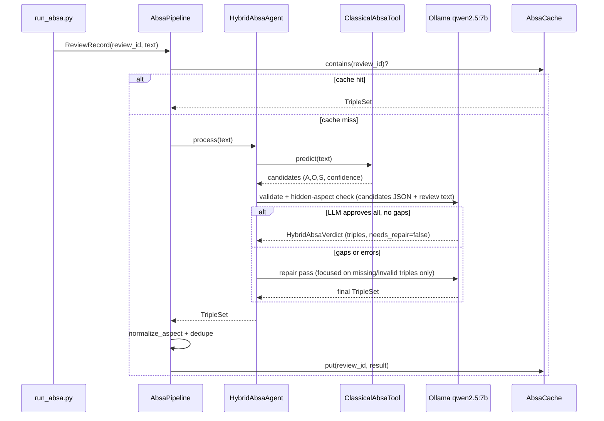

# feat: Hybrid ABSA Agent — LLM orchestrator + DeBERTa classical tool

## Summary

Redesign the offline ABSA pipeline from **pure LLM extract→judge** (2 Ollama calls per review, ~2.7s each) to a **hybrid Agent+Tool** architecture: a lightweight LLM “chief engineer” (`qwen2.5:7b`) orchestrates a fast classical ABSA tool (PyABSA / DeBERTa family), validates tool output against the review, recovers missed “hidden” aspects, and emits the same `TripleSet` cache contract the KG and evaluation harness already consume.

The paper narrative targets **system efficiency**: measurable latency reduction on the scoped train target set (`absa_targets.jsonl`) while preserving (or improving) triple quality on the existing gold eval track (`make absa-quality`).

**Target repo:** EmoRecAgent. All paths below are repo-relative.

---

## Problem Frame

The current ABSA path (`AbsaExtractor` + `AbsaJudge`) sends the **full review text** through Ollama twice per uncached review. Even after scoping to the processed train subset (~40k–80k reviews), batch ABSA remains **LLM-bound** (~1–3 days). The original multi-agent plan (origin R2, origin KTD3 in `docs/plans/2026-06-10-001-feat-emorecagent-multi-agent-plan.md`) chose PASTEL-style extract→judge for accuracy, but did not explore classical ABSA acceleration. The `llm_only` backend preserves that methodological path; hybrid is an efficiency variant gated before becoming the shipped default.

The user’s proposed hybrid design addresses **latency and cost** without abandoning the LLM’s role in the multi-agent story: the ABSA Agent becomes an **orchestrator** that delegates heavy lifting to a specialized encoder model and uses the LLM only for validation, gap-filling, and structured output — aligning with Q1 “system efficiency” claims when backed by a reproducible benchmark.

**Constraint from the named model:** [yangheng/deberta-v3-base-absa-v1.1](https://huggingface.co/yangheng/deberta-v3-base-absa-v1.1) is a **sentiment classifier** (`text` + `text_pair=aspect` → polarity). It does **not** perform aspect-term extraction alone. End-to-end (aspect, opinion, sentiment) requires **PyABSA ATEPC** (recommended on the model card) or a two-stage ATE + classifier pipeline. This plan adopts **PyABSA as the Tool implementation**, with the DeBERTa checkpoint configurable via YAML.

---

## Requirements

| ID | Requirement |
| --- | --- |
| R1 | Introduce a **Classical ABSA Tool** that returns candidate `(aspect, opinion, sentiment)` triples from review text without an LLM read of the full extraction task. Default backend: PyABSA `ATEPC.AspectExtractor` with a DeBERTa-family checkpoint (configurable; `multilingual` or HF-linked checkpoint). |
| R2 | Introduce a **Hybrid ABSA Agent** (LLM orchestrator) that: (a) calls the Tool, (b) validates candidates against the review (drop unsupported, fix polarity), (c) detects and fills **hidden aspects** the Tool missed, (d) returns `TripleSet` matching `src/emorecagent/llm/schemas.py`. |
| R3 | Refactor `AbsaPipeline` with `absa.backend: hybrid | llm_only`. **Ship default `llm_only`** until R11 quality gate passes; then flip `configs/default.yaml` to `hybrid`. Both backends available for ablation at any time. |
| R4 | **No change** to downstream contracts: `AbsaCache` schema, `load_absa_cache`, `aggregate_item_sentiment_from_cache`, `build_recommend_context`, and `make absa-quality` gold eval must work unchanged on hybrid output. |
| R5 | Continue using **train-scoped targets** (`absa.targets_path` from `make data`); hybrid does not widen scope to the full 24M-review category. |
| R6 | Add a **latency benchmark** script that compares `llm_only` vs `hybrid` on the same review subset (configurable N, e.g. 200) and reports per-review p50/p95/mean latency, mean LLM calls, `repair_rate`, and speedup ratio. Measurement only — the ≥80% target is a paper hypothesis, not a ship gate. |
| R7 | Add **optional ML dependencies** (`torch`, `transformers`, `pyabsa`) so users without GPU can still install the base package; document `pip install -e ".[absa-ml]"` in README. |
| R8 | **Cache invalidation:** `absa.pipeline_version` in config plus sidecar `cache_manifest.json` next to the SQLite file. `run_absa` refuses to run when manifest version mismatches config (exit with `make clean-absa` hint). `AbsaCache` table schema unchanged (R4). |
| R9 | Unit and integration tests with **mocked Tool** and `FakeLLM` — no GPU required in CI. |
| R10 | Update README and `docs/EXPERIMENTS.md` with hybrid architecture, install (`[absa-ml]`), benchmark + quality-gate workflow, and paper positioning (see U6). |
| R11 | **Quality gate before hybrid default:** run `make absa-quality` (or equivalent) per backend on gold set; compare macro F1; flip default to `hybrid` only if drop ≤ 2pt vs `llm_only`. Document in `results/absa_quality_comparison.json` and EXPERIMENTS. |

---

## High-Level Technical Design

### Hybrid pipeline (available via `absa.backend: hybrid`; `llm_only` ships as default until R11)

### LLM call budget (design target)

| Path | Typical LLM calls / review | Dominant cost |
| --- | --- | --- |
| Legacy `llm_only` | 2 (extract + judge) | Full-text extraction + validation |
| Hybrid fast path | 1 (candidate-only validate) | High-confidence Tool output; no full review text when all candidates pass confidence threshold |
| Hybrid standard validate | 1 (full validate) | Candidates JSON + review text (similar cost to legacy judge) |
| Hybrid repair path | 2 (validate + repair) | When Tool misses hidden aspects or validate flags `needs_repair` |

Classical Tool inference (GPU): ~50–300 ms/review; CPU: slower but acceptable for dev. **≥80% latency reduction** is a paper hypothesis — achievable only when fast-path validate dominates and `repair_rate` is low (R6 reports `repair_rate`, `validate_only_rate`, `llm_calls_mean`).

### What stays unchanged

- LangGraph `absa_node` continues to **load precomputed cache** (`GraphDeps.load_triples`) — no per-request Tool+LLM in the graph for offline eval.
- Scoped targets export (`src/emorecagent/absa/targets.py`) unchanged.
- Triple normalization and `(aspect, sentiment)` dedupe in `AbsaPipeline` unchanged.

---

## Key Technical Decisions

| ID | Decision | Rationale |
| --- | --- | --- |
| KTD1 | **PyABSA ATEPC as the Tool**, not raw `transformers.pipeline` on `deberta-v3-base-absa-v1.1` alone | The HF model classifies sentiment **given** an aspect; PyABSA provides end-to-end aspect extraction + sentiment in one call and is the maintainer-recommended integration path for that checkpoint family. |
| KTD2 | **HybridAbsaAgent** available via `absa.backend: hybrid`; **origin R2/KTD3 preserved** under `llm_only` until R11 gate flips default | Paper methodology row uses `llm_only`; hybrid is efficiency variant after quality parity. |
| KTD3 | **Validate + conditional repair prompts** (`ABSA_AGENT_VALIDATE_V1`, `ABSA_AGENT_REPAIR_V1`) | Repair only when `needs_repair`; validate may use candidate-only fast path when Tool confidence is high (KTD8). |
| KTD8 | **Candidate-only validate fast path** when all Tool candidates exceed `classical_min_confidence` and no gap hints | Skips embedding full review text on fast path to approach ≥80% latency hypothesis; full text used on repair and standard validate. |
| KTD4 | **Optional dependency group `[absa-ml]`** in `pyproject.toml` | Base install stays lightweight (Ollama-only users); ML stack is explicit opt-in. |
| KTD5 | **`pipeline_version` + `cache_manifest.json`** sidecar; startup mismatch → exit | Operational invalidation without changing `AbsaCache` SQL schema (R4). `make clean-absa` removes both sqlite and manifest. |
| KTD6 | **Tool confidence mapped to `AbsaTriple.confidence`** from PyABSA probability; LLM may adjust on validate | Preserves judge semantics and `min_confidence` filtering in `AbsaJudge`-equivalent logic inside the agent. |
| KTD7 | **Defer online/graph live hybrid ABSA** | Original plan (U9 graph orchestration) loads ABSA from offline cache; adding Tool+LLM per graph invocation is out of scope and would break eval reproducibility. |

---

## Scope Boundaries

**In scope**

- Hybrid offline batch path (`scripts/run_absa.py`, `AbsaPipeline`)
- Config, optional deps, tests, latency benchmark, docs
- Ablation flag for legacy LLM-only backend

**Out of scope**

- Retraining or fine-tuning DeBERTa on Beauty reviews
- Removing Ollama from ABSA entirely (LLM remains orchestrator)
- Changing KG schema, scoring formulas, or eval metrics
- Neo4j live ingestion redesign

### Origin traceability

| Origin artifact | Hybrid plan relationship |
| --- | --- |
| Origin R2 (LLM extract→judge) | Satisfied by `absa.backend: llm_only` — paper methodology baseline |
| Origin KTD3 (PASTEL modular ABSA) | Same — `llm_only` path unchanged |
| Origin R13 (gold triple F1) | Extended by R11 — compare backends before flipping default |
| Hybrid default | **Not** a supersession of origin R2; efficiency engineering path after R11 gate |

### Deferred to Follow-Up Work

- Wiring HybridAbsaAgent into LangGraph `absa_node` for single-review interactive demo
- GPU batching / multi-worker Tool inference for further throughput
- Aspect vocabulary alignment between PyABSA English-centric training and beauty-domain synonyms (beyond existing `normalize_aspect`)

---

## Implementation Units

### U1. Config and optional ML dependencies

- **Goal:** Extend `AbsaCfg` and `pyproject.toml` for hybrid backend selection and Tool settings.
- **Requirements:** R3, R7, R8
- **Dependencies:** none
- **Files:** `src/emorecagent/config.py`, `configs/default.yaml`, `pyproject.toml`, `scripts/warmup_absa_checkpoint.py`, `tests/test_config.py`
- **Approach:** Add fields: `backend: hybrid | llm_only` (**default `llm_only`** until R11), `classical_checkpoint`, `classical_checkpoint_path` (optional local dir for air-gap), `classical_device`, `classical_min_confidence` (fast-path threshold), `pipeline_version` (default `hybrid-v1`), `repair_on_gap: true`. Pin `[absa-ml]`: `pyabsa==2.4.2`, compatible `torch`/`transformers` ranges. `warmup_absa_checkpoint.py` prefetches checkpoint on first install.
- **Test scenarios:**
  - Loads `configs/default.yaml` with new absa fields.
  - Unknown `absa.backend` value rejected by pydantic.
  - `pipeline_version` present and non-empty.
- **Verification:** `pytest tests/test_config.py` passes; `pip install -e ".[absa-ml]"` resolves without error on Python 3.11.

---

### U2. Classical ABSA Tool adapter

- **Goal:** Thin adapter from PyABSA output to `list[AbsaTriple]`.
- **Requirements:** R1, R9
- **Dependencies:** U1
- **Files:** `src/emorecagent/absa/classical.py`, `tests/absa/test_classical.py`
- **Approach:** `ClassicalAbsaTool`: `__init__` loads `ATEPC.AspectExtractor` once (log warmup seconds); `predict(text)` runs inference only. **Opinion policy:** PyABSA returns aspect + sentiment + token positions, not opinion phrases — emit `opinion=""` and aspect text as placeholder; **U3 LLM validate must fill grounded opinion phrases** from review text. Map `Positive/Negative/Neutral` → lowercase; map PyABSA probability → `confidence`. Import guard in `build_absa_pipeline` (not lazy per predict). `MockClassicalAbsaTool` for tests.
- **Patterns to follow:** Adapter style in `src/emorecagent/absa/extractor.py` (single responsibility, no cache).
- **Test scenarios:**
  - Mock backend returns fixed triples; adapter maps fields correctly.
  - Empty review → empty list.
  - Missing optional dep → informative error message mentioning `pip install -e ".[absa-ml]"`.
  - Sentiment label normalization (`Positive` → `positive`).
  - Covers R9: `MockClassicalAbsaTool` used in tests without `[absa-ml]`.
- **Verification:** Tests pass without GPU; no network in unit tests.

---

### U3. Hybrid ABSA Agent (LLM orchestrator)

- **Goal:** LLM validates Tool output, fills hidden aspects, emits `TripleSet`.
- **Requirements:** R2, R9
- **Dependencies:** U2
- **Files:** `src/emorecagent/absa/agent.py`, `src/emorecagent/llm/prompts.py`, `src/emorecagent/llm/schemas.py`, `tests/absa/test_agent.py`
- **Approach:** `HybridAbsaAgent(classical: ClassicalAbsaTool, client: LLMClient, *, min_confidence, repair_on_gap)`. Flow:
  1. `candidates = classical.predict(text)`
  2. **Fast path (KTD8):** if all candidates ≥ `classical_min_confidence` → `ABSA_AGENT_VALIDATE_FAST_V1` (candidates only, no review body)
  3. **Standard validate:** `ABSA_AGENT_VALIDATE_V1` — `HybridAbsaVerdict` (`triples`, `needs_repair`, `missing_aspect_hints`); LLM fills `opinion` for each triple
  4. If `needs_repair` and `repair_on_gap`: `ABSA_AGENT_REPAIR_V1` with hints + review text + candidates → `TripleSet`
  5. Filter by `min_confidence`; expose counters (`repair_rate`, `llm_calls`) for U6
  Prompt rules: no unsupported aspects; max 15 triples.
- **Patterns to follow:** `AbsaJudge.judge` candidate JSON pattern; `LLMClient.invoke_structured` from `src/emorecagent/llm/client.py`.
- **Test scenarios:**
  - Tool returns 2 candidates; FakeLLM returns validated set unchanged → 2 triples.
  - FakeLLM sets `needs_repair=true`; repair prompt invoked once; final triples include added hidden aspect.
  - Tool returns []; LLM asked to find aspects from text only in repair path.
  - All triples below `min_confidence` filtered out.
  - Covers R9: `HybridAbsaVerdict` pydantic validation in `schemas.py`.
- **Verification:** Agent tests pass with `FakeLLM` only.

---

### U4. Refactor AbsaPipeline and builder

- **Goal:** Wire hybrid backend; preserve legacy; enforce cache manifest.
- **Requirements:** R3, R4, R8, R9
- **Dependencies:** U3
- **Files:** `src/emorecagent/absa/pipeline.py`, `tests/absa/test_pipeline.py`
- **Approach:** `build_absa_pipeline(cfg, client)` in `pipeline.py` (no separate factory module). Selects:
  - `hybrid` → `HybridAbsaAgent` + shared normalize/dedupe/cache path
  - `llm_only` → existing `AbsaExtractor` + `AbsaJudge`
  Define `AbsaTextProcessor` Protocol; implement `LlmOnlyProcessor` (extract+judge) and `HybridProcessor` (agent). On startup: read/write `cache_manifest.json` with `pipeline_version`; mismatch → `ConfigError` with clean-absa hint. Keep normalize/dedupe/cache in `process()`.
- **Test scenarios:**
  - `backend=llm_only` still runs extract→judge (existing tests green).
  - `backend=hybrid` with mock Tool + FakeLLM produces cached triple on second `process()` call.
  - Normalize + dedupe behavior unchanged for duplicate `(aspect, sentiment)`.
- **Verification:** `tests/absa/test_pipeline.py` and resilience tests pass.

---

### U5. Update batch runner and Makefile

- **Goal:** `make absa` uses hybrid pipeline; surface backend in logs.
- **Requirements:** R3, R5, R8
- **Dependencies:** U4
- **Files:** `scripts/run_absa.py`, `Makefile`, `README.md`
- **Approach:** Use `build_absa_pipeline`. Log `backend`, `pipeline_version`, `classical_checkpoint`, Tool warmup time. Check `[absa-ml]` when `backend=hybrid`. Enforce `cache_manifest.json` version (R8). README: install `[absa-ml]` before hybrid; default remains `llm_only` until R11.
- **Test scenarios:**
  - `run_absa` with missing targets file → same error as today.
  - Integration smoke: `--max-reviews 3` with mock (test-only env flag) completes without crash.
- **Verification:** `make absa` log line shows active `backend` (default `llm_only` until R11).

---

### U6. Benchmark, quality gate, and documentation

- **Goal:** Reproducible latency + quality comparison; paper narrative; Makefile targets.
- **Requirements:** R6, R10, R11
- **Dependencies:** U5
- **Files:** `scripts/benchmark_absa_latency.py`, `scripts/compare_absa_quality.py` (or extend `eval_absa_quality.py`), `Makefile`, `README.md`, `docs/EXPERIMENTS.md`
- **Approach:**
  - **Latency:** CLI `--n-reviews 200`, `--backends hybrid,llm_only`, `--warmup 5`. Use **isolated temp cache** per backend (`/tmp/absa_bench_{backend}.sqlite`) — never touch production cache. Report p50/p95/mean, `speedup_ratio`, `repair_rate`, `validate_only_rate`, `llm_calls_mean` → `results/absa_latency.json`.
  - **Quality gate (R11):** Run absa on gold review ids per backend; `make absa-quality` or `compare_absa_quality.py` → `results/absa_quality_comparison.json` with macro F1 delta. If ≤2pt drop, document flip to `backend: hybrid` in default.yaml.
  - **Makefile:** `absa-benchmark` target; README documents `pip install -e ".[absa-ml]"`, `make warmup-absa` (checkpoint prefetch), benchmark + quality workflow.
  - **Paper positioning:** ABSA hybrid = **offline tool-augmented extraction stage**; four-agent LangGraph story = Profiling→Reasoning→Reflection; efficiency subsection cites R6+R11; origin R2/`llm_only` remains methodology baseline in tables (quality row first, latency row second).
- **Test scenarios:**
  - Benchmark dry-run `n=2` writes JSON with all required keys including `repair_rate`.
  - Temp cache paths do not modify `data/processed/.../absa_cache.sqlite`.
  - Quality comparison script runs on fixture gold without GPU.
- **Test expectation:** none for README prose.
- **Verification:** `make absa-benchmark` exists; README commands match Makefile; R11 gate documented before default flip.

---

## Risks & Dependencies

| Risk | Mitigation |
| --- | --- |
| PyABSA install weight / CUDA friction | Optional `[absa-ml]`; document CPU fallback; CI uses mocks only |
| Beauty-domain aspect vocabulary mismatch (English product reviews) | LLM validate/repair step; report quality delta on gold set (origin plan R13 via `make absa-quality`) |
| Hybrid slower than expected if repair always triggers | Log `repair_rate` in benchmark JSON; tune validate prompt to reduce false repair |
| Claimed 80% latency reduction not met on CPU | Report honest numbers; paper cites GPU batch numbers + scoped N |
| Cache mixing after backend switch | `cache_manifest.json` startup check + `make clean-absa` (U4/U5) |

**Prerequisites:** `make data` (targets file), Ollama `qwen2.5:7b`, optional GPU for Tool, `pip install -e ".[absa-ml]"` for hybrid.

---

## Open Questions

| ID | Question | Default if unresolved |
| --- | --- | --- |
| Q1 | Exact PyABSA checkpoint: `multilingual` vs pinning `yangheng/deberta-v3-base-absa-v1.1` via ATEPC config | Start with `multilingual`; make checkpoint YAML-overridable |
| Q2 | Accept CPU-only hybrid for paper benchmarks? | Yes for dev; recommend GPU for reported latency table |
| Q3 | Require hybrid triple F1 ≥ LLM-only on gold before switching default? | **Resolved:** R11 enforces 2pt macro F1 tolerance; ship `llm_only` default until gate passes (see U6) |

---

## Sources & Research

- Codebase: `src/emorecagent/absa/{extractor,judge,pipeline,cache,targets}.py`, `scripts/run_absa.py`, `configs/default.yaml`
- Origin plan: `docs/plans/2026-06-10-001-feat-emorecagent-multi-agent-plan.md` (origin R2, origin KTD3 — preserved under `llm_only`)
- External: [yangheng/deberta-v3-base-absa-v1.1](https://huggingface.co/yangheng/deberta-v3-base-absa-v1.1) — PyABSA ATEPC usage, model card limitations (classifier vs full ATE)
- Scoped targets (prior work): train-scoped `absa_targets.jsonl` via `make data`
