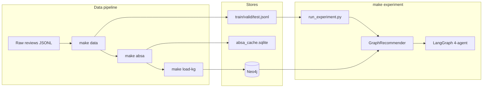
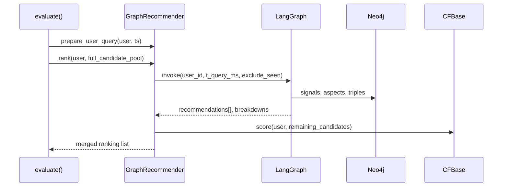

# feat: Wire LangGraph experiment, Neo4j KG load, verified_purchase splits

## Summary

Connect the existing four-agent LangGraph pipeline to `make experiment` as the primary `emorecagent` method, add a `make load-kg` step that hydrates Neo4j from train interactions plus the ABSA SQLite cache, and persist `verified_purchase` on processed split JSONL (especially `test.jsonl`) so evaluation can treat verified buys as ground-truth signal.

## Problem Frame

EmoRecAgent’s research path depends on a multi-agent LangGraph loop (ABSA → profiling → reasoning → reflection → explanation), but `make experiment` today uses `EmoRecRecommender` — numeric profiling and full-catalog `S(u,i)` scoring only, with no reflection or LLM reasoning. Neo4j infrastructure exists (`KGRepository`, loaders, Docker) but nothing populates it during the data/ABSA pipeline. Processed splits omit `verified_purchase` even though raw Amazon reviews carry it and `Interaction` already models it, blocking purchase-verified ground-truth analysis on `test.jsonl`.

## Requirements

| ID | Requirement |
|----|-------------|
| R1 | `make experiment` with `--method emorecagent` runs the four-agent LangGraph pipeline as the primary scoring path (not the legacy numeric-only recommender). |
| R2 | A documented `make load-kg` (or equivalent) loads **train-scoped** interactions and ABSA cache triples into Neo4j, including aggregated `HAS_SENTIMENT` edges. |
| R3 | `train.jsonl`, `valid.jsonl`, and `test.jsonl` each include `verified_purchase` (boolean); `test.jsonl` rows remain the ranking ground truth with purchase verification available for filtering and reporting. |
| R4 | Experiment prerequisites are explicit: `make data` → `make absa` → `make load-kg` → `make experiment` (Neo4j up). |
| R5 | Full-catalog ranking metrics (`HR@K`, `NDCG@K`, etc.) remain computable; graph pool size must not silently shrink the eval candidate universe. |
| R6 | Developers can cap eval cost via config/CLI (`max_test_rows`, optional `use_llm_cot=false`) without changing the default “full method” shape. |

## Key Technical Decisions

### KTD1 — `emorecagent` becomes LangGraph-backed; legacy path renamed

**Decision:** `build_recommender("emorecagent", …)` returns a new `GraphRecommender` that invokes `build_emorec_graph`. The current `EmoRecRecommender` moves to `emorecagent_fast` (or `emorecagent_numeric`) for ablations and fast CI smoke tests.

**Rationale:** User stated LangGraph is the primary method; keeping the fast path under a distinct name avoids breaking ablation scripts while making the default experiment honest.

### KTD2 — Full-catalog ranking via graph-first + numeric tail

**Decision:** `GraphRecommender.rank(user_id, candidates)` runs one graph invocation per test row (profiling → reasoning → reflection loop) to produce an ordered top-`K_graph` list (default `top_k=5` from config). Remaining candidates are ordered by the same numeric `S(u,i)` used inside `ReasoningAgent` (no extra LLM calls). Final ranking = `[graph_top…] + [numeric_tail…]`, deduplicated, truncated to `len(candidates)`.

**Rationale:** `evaluate()` in `eval/runner.py` passes the full unseen-item pool (~11k items). The graph’s internal `pool_size=200` candidate construction is correct for agent reasoning but incompatible with HR@10 on the full catalog if used alone. Graph ordering at the head preserves the multi-agent decision; numeric tail preserves metric comparability with baselines.

### KTD3 — Neo4j is the KG backend for graph experiments; in-memory remains for unit tests

**Decision:** `GraphRecommender` reads user signals, item aspects, and triples through `KGRepository` (Neo4j). `build_recommend_context` stays for `emorecagent_fast` and tests. Add `Neo4jKGAdapter` implementing the small surface `GraphDeps` needs (`get_user_signals`, `get_item_aspects`, `load_triples`, `aspect_support`).

**Rationale:** User explicitly wants cache in Neo4j; U5–U6 of the origin multi-agent plan assumed Neo4j-backed profiling. In-memory path is already complete for fast iteration.

### KTD4 — Train-only KG hydration (no valid/test leakage)

**Decision:** `load-kg` writes **only** `train.jsonl` interactions and train-scoped ABSA cache rows (same filter as `build_recommend_context` / `export_absa_targets`). Valid and test interactions are never upserted into Neo4j.

**Rationale:** Matches temporal eval protocol; test items must not appear in KG sentiment aggregates before their query timestamp.

### KTD5 — `verified_purchase` persisted and exposed to eval

**Decision:** Emit `verified_purchase` in `_write_jsonl`; parse it in `load_split_jsonl` (default `false` for backward-compatible reads). Store on `REVIEWED` edges in Neo4j. Eval runner accepts `--verified-only` (default `false`) to restrict test rows; results JSON records `n_test_rows`, `n_verified_rows`, and `verified_only` flag.

**Rationale:** User needs purchase-verified ground truth on test rows for trustworthy comparison; default-off filter keeps metrics comparable with prior runs until splits are regenerated.

### KTD6 — Shared review index builder

**Decision:** Replace fragile `build_review_index_from_jsonl` (requires `review_id` in raw rows) with `build_review_index_from_scope(train, raw_review_path)` using the same `(user_id, item, timestamp)` matching and `_review_id` fallback as `export_absa_targets`.

**Rationale:** Amazon Reviews 2023 JSONL often lacks a stable `review_id`; cache keys must align between ABSA export, in-memory load, and Neo4j load.

### KTD7 — Eval cost controls

**Decision:** `configs/default.yaml` gains `experiment.max_test_rows` (default `null` = all rows) and `experiment.use_llm_cot` (default `true`). `scripts/run_experiment.py` passes these through. Progress logging remains.

**Rationale:** ~22k test rows × (reflection retries × Ollama calls) is impractical for dev loops; caps are operational, not a method change.

---

## High-Level Technical Design

### Pipeline integration

### Per test-row eval sequence

---

## Scope Boundaries

### In scope

- LangGraph wiring for `emorecagent` experiment method
- `make load-kg` script + Makefile target + README pipeline docs
- `verified_purchase` on all three split files and Neo4j `REVIEWED` edges
- Review-index alignment for Neo4j ABSA load
- Tests for split field, loader, and graph recommender smoke (mocked Neo4j / FakeLLM)
- Regenerate splits note (`make data` required after U1)

### Out of scope

- Re-running ABSA or full 22k-row production experiment (operational, not code)
- Neo4j GraphRAG / `langchain-neo4j` integration
- Changing baseline methods or metric definitions
- Storing review `text` in split JSONL

### Deferred to Follow-Up Work

- Persisting graph `explanation` artifacts per test row for qualitative eval (U10-style rationalization bench)
- Parallel/batched Ollama requests for throughput
- Incremental Neo4j sync after partial ABSA resume (full reload acceptable for v1)
- `verified_purchase` breakdown in published results tables (reporting layer)

---

## System-Wide Impact

- **Researchers:** Default experiment reflects the paper method; expect longer runtimes and Neo4j + Ollama prerequisites.
- **CI:** Keep graph tests on `FakeLLM`; add fast `emorecagent_fast` smoke in pytest; optional slow integration marker for real Ollama.
- **Data artifacts:** Split JSONL schema change requires `make data` rebuild; old files remain readable via `verified_purchase` default.

---

## Risks & Dependencies

| Risk | Mitigation |
|------|------------|
| Full eval runtime (hours–days) | `max_test_rows`, `use_llm_cot=false`, document expected GPU/Ollama footprint |
| Neo4j empty/misconfigured | `make neo4j` + `verify_neo4j` gate in `load-kg`; clear error if bolt fails |
| Review index mismatch → empty ABSA in Neo4j | Shared scope builder; loader logs `n_triples_loaded` / `n_sentiment_edges` |
| Metric shift vs prior `EmoRecRecommender` numbers | Document method change; keep `emorecagent_fast` for A/B |
| Graph top-1 differs from numeric top-1 | Intended behavior; record in experiment metadata |

**Prerequisites:** Docker Neo4j running, Ollama with configured model, completed `make absa`, regenerated splits with `verified_purchase`.

---

## Implementation Units

### U1. Persist `verified_purchase` in processed splits

**Goal:** Train/valid/test JSONL rows carry purchase verification from raw Amazon data.

**Requirements:** R3

**Dependencies:** none

**Files:** `src/emorecagent/data/split.py`, `src/emorecagent/eval/runner.py`, `tests/data/test_split.py`, `tests/eval/test_runner.py`

**Approach:** Extend `_write_jsonl` to emit `verified_purchase: it.verified_purchase`. Extend `load_split_jsonl` to read `verified_purchase` with default `false`. Add manifest field `pct_verified_test` in `write_split` manifest for quick QA.

**Patterns to follow:** Existing `helpful_vote` optional-field handling in `loader.py`.

**Test scenarios:**
- Happy path: fixture interaction with `verified_purchase=True` round-trips through write/read.
- Edge case: missing key in legacy JSONL loads as `false`.
- Edge case: test split manifest reports verified fraction > 0 on real-category fixture.
- Integration: `build_dataset.py` output line includes key (characterization via split unit test with mocked interactions).

**Verification:** After `make data`, `test.jsonl` first line contains `"verified_purchase":` key; manifest logs verified share.

---

### U2. Neo4j KG loader CLI and train-scoped hydration

**Goal:** One command populates Neo4j from train split + ABSA cache.

**Requirements:** R2, R4, R6 (index alignment)

**Dependencies:** U1 (for `verified_purchase` on REVIEWED edges)

**Files:** `scripts/load_kg.py`, `src/emorecagent/kg/loaders.py`, `src/emorecagent/kg/repository.py`, `src/emorecagent/kg/schema.py`, `Makefile`, `tests/kg/test_loaders.py`, `tests/kg/test_repository.py`

**Approach:**
- Add `build_review_index_from_scope(train, raw_path)` in `loaders.py` (relocate shared logic from `absa/targets.py` or import from a new `data/review_index.py` module).
- Extend `upsert_interaction` Cypher to `SET r.verified_purchase = $verified_purchase`.
- `load_kg.py`: load config → connect driver → `ensure_schema` → optional `MATCH (n) DETACH DELETE n` when `--fresh` → load train interactions only → load ABSA triples + `aggregate_item_sentiment_from_cache` with train cutoff → print counts JSON.
- Makefile target `load-kg` depends on `neo4j` verify.

**Patterns to follow:** `scripts/verify_neo4j.py`, existing `load_split_dir` / `load_absa_cache`.

**Test scenarios:**
- Happy path: in-memory `KGStore` fake receives expected interaction count from train fixture.
- Happy path: cache row with matching scope index creates SIGNAL + HAS_SENTIMENT edges.
- Edge case: valid/test paths ignored when present in split dir.
- Error path: missing cache file exits with actionable message.
- Integration: `verified_purchase=true` stored on REVIEWED (mock driver capture SET params).

**Verification:** `make load-kg` then Cypher `MATCH ()-[r:REVIEWED]->() RETURN count(r)` matches train rows; `MATCH ()-[s:HAS_SENTIMENT]->() RETURN count(s) > 0`.

---

### U3. Neo4j adapter for graph dependencies

**Goal:** `GraphDeps` callables read from Neo4j instead of in-memory fixtures.

**Requirements:** R2, R1 (enabler)

**Dependencies:** U2

**Files:** `src/emorecagent/kg/neo4j_adapter.py`, `src/emorecagent/recommend/graph_context.py`, `tests/kg/test_neo4j_adapter.py`

**Approach:** Implement adapter methods:
- `get_user_signals(user_id, before_ts)` → `KGRepository.get_user_signals`
- `get_item_aspects(item_id)` → rescaled `get_item_aspects`
- `load_triples(user_id)` → Cypher query for user's SIGNAL edges (or batch preloaded map keyed by user)
- `aspect_support(item_id)` → from HAS_SENTIMENT `n_support`

`build_graph_context(cfg, driver)` constructs `GraphDeps`, `ReasoningAgent`, `ReflectionAgent`, `DynamicUserProfilingAgent`, and LLM client from config (mirror test `_build_graph` helpers).

**Patterns to follow:** `tests/graph/test_pipeline.py` `_build_graph`, `RecommendContext` field names in `configs/default.yaml`.

**Test scenarios:**
- Happy path: Fake driver / repository test double returns signals consumed by profiling agent.
- Edge case: user with no signals returns empty weights (existing profiling policy).
- Error path: Neo4j connection failure surfaces as `ConfigError` with URI hint.

**Verification:** Adapter unit tests pass; manual `build_graph_context` + single `graph.invoke` against loaded Neo4j succeeds.

---

### U4. `GraphRecommender` and eval harness integration

**Goal:** `make experiment --method emorecagent` uses LangGraph end-to-end with full-catalog ranking.

**Requirements:** R1, R5, R6

**Dependencies:** U3

**Files:** `src/emorecagent/recommend/graph_recommender.py`, `src/emorecagent/eval/runner.py`, `src/emorecagent/recommend/emorec.py` (rename export), `scripts/run_experiment.py`, `configs/default.yaml`, `tests/recommend/test_graph_recommender.py`, `tests/graph/test_pipeline.py`

**Approach:**
- Implement `GraphRecommender(Recommender)` with `name = "emorecagent"`, `prepare_user_query`, `fit` (builds CF on train only), `rank` per KTD2.
- `build_recommender`: `emorecagent` → `GraphRecommender`; add `emorecagent_fast` → existing `EmoRecRecommender`.
- `evaluate()`: honor `verified_only` filter before loop; pass `max_test_rows` slice.
- `run_experiment.py`: wire new config keys; log graph-specific metadata in results JSON (`method_variant: langgraph`, `use_llm_cot`, `max_test_rows`).

**Execution note:** Add failing test for `rank()` returning graph-top item ahead of numeric-only baseline on a controlled fixture before implementing merge logic.

**Patterns to follow:** `EmoRecRecommender.score` / `rank_items`, `build_emorec_graph` invoke shape from `test_pipeline.py`.

**Test scenarios:**
- Happy path: FakeLLM graph recommender `rank()` places reflected top item first in full candidate list.
- Happy path: `prepare_user_query` sets `t_query_ms` so signals before test timestamp excluded (temporal leak test).
- Edge case: empty candidate list returns `[]`.
- Edge case: graph returns fewer than K items; tail filled numerically without duplicate items.
- Integration: `evaluate()` on 3-row fixture with `verified_only=true` skips unverified rows.
- Error path: Ollama unreachable → typed error with retry hint (do not hang silently).

**Verification:** `make experiment METHOD=emorecagent MAX_TEST_ROWS=10` completes and writes `results/` JSON with `method: emorecagent`; ranking protocol still `full_catalog`.

---

### U5. Documentation and pipeline orchestration

**Goal:** README and Makefile reflect the new canonical experiment path.

**Requirements:** R4

**Dependencies:** U2, U4

**Files:** `README.md`, `Makefile`, `docs/EXPERIMENTS.md` (if present), `configs/default.yaml`

**Approach:** Document ordered pipeline: `make data` → `make absa-targets` → `make absa` → `make neo4j` → `make load-kg` → `make experiment`. Note split regeneration after upgrade. Document `emorecagent_fast`, `MAX_TEST_ROWS`, `VERIFIED_ONLY`, runtime expectations.

**Test scenarios:** Test expectation: none — documentation-only unit.

**Verification:** New contributor can follow README without reading source; `make help` or README lists `load-kg`.

---

## Open Questions

| Question | Status |
|----------|--------|
| Should `verified_only` default flip to `true` for published numbers? | Deferred — default `false` until user regenerates data and confirms verified share |
| Optimal `pool_size` vs full-catalog tail ordering for HR@10 | Deferred to implementation tuning; start with config defaults (200 / top_k=5) |

## Acceptance Examples

1. **AE1 — Verified test row:** After `make data`, a line in `data/processed/Beauty_and_Personal_Care/test.jsonl` includes `"verified_purchase": true` alongside `user_id`, `item`, `rating`, `timestamp`.
2. **AE2 — Neo4j populated:** After `make load-kg`, Neo4j Browser shows User–REVIEWED–Item edges and Item–HAS_SENTIMENT–Aspect edges with non-zero counts.
3. **AE3 — LangGraph experiment:** `make experiment` with default config runs `emorecagent` through LangGraph (log shows profiling/reasoning/reflection stages), not only `EmoRecRecommender` numeric scoring.
4. **AE4 — Metric compatibility:** Results JSON lists `protocol: full_catalog` and HR@K keys for `emorecagent` same as `svd` baseline structure.

## Sources & Research

- Origin architecture: `docs/plans/2026-06-10-001-feat-emorecagent-multi-agent-plan.md` (U5 Neo4j, U8–U9 agents, U11 LangGraph)
- Existing graph tests: `tests/graph/test_pipeline.py`
- Current experiment gap: `src/emorecagent/recommend/emorec.py` bypasses LangGraph
- External research: skipped — local patterns sufficient (LangGraph, Neo4j driver already in repo)
