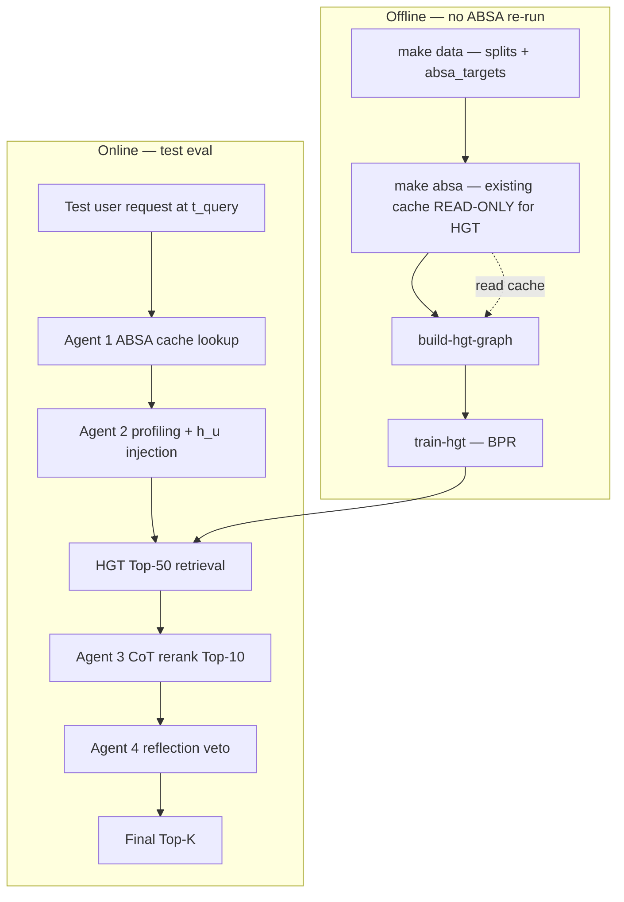

# feat: pyHGT neural retriever under 4-agent orchestration

## Summary

Integrate the vendored **pyHGT** heterogeneous graph encoder as a **train-time representation learner** and **inference-time candidate retriever** (Top-K item pool) orchestrated by the existing **4-agent LangGraph pipeline** (ABSA → Profiling → Reasoning → Reflection). The heterogeneous graph is built from the **processed Amazon train split + existing ABSA cache + item metadata**, trained offline with **BPR link prediction** on `(user, buys, item)` edges, then wired into Agent 2 (user embedding injection) and Agent 3 (HGT retriever → CoT rerank). **Existing ABSA artifacts must not be deleted or invalidated** by this work.

---

## Problem Frame

The current system ranks over full catalogs using **SVD/ItemKNN** (`src/emorecagent/scoring/cf_base.py`) and a numeric aspect term. LangGraph agents add interpretability and constraint checking, but **candidate selection still scales poorly** when CoT must reason over thousands of items. The user proposes replacing the coarse CF retriever with **pyHGT embeddings** on a heterogeneous graph whose schema aligns with ABSA-derived aspects.

**Constraints from the user (hard):**

- Keep all data through **`make absa`** intact — do not require `make clean-absa`, do not change `absa.pipeline_version` in a way that invalidates the running cache without an explicit opt-in migration.
- Reuse the **existing 4 agents** and chronological Amazon splits already produced by `make data`.
- pyHGT code lives under `model/pyHGT/` (vendored); integration code belongs in `src/emorecagent/`.

**Gap vs. current repo:**

- pyHGT is **not referenced** from `src/emorecagent/`.
- Neo4j schema (`User`, `Item`, `Aspect`; `REVIEWED`, `SIGNAL`, `HAS_SENTIMENT`, `PREFERS`) is **conceptually aligned** but uses different storage/API than pyHGT's `Graph` pickle format.
- pyHGT pins **torch 1.13 / PyG 1.3**; main project uses **torch ≥2.0** for `[absa-ml]` — dependency isolation is required.

---

## Requirements

| ID | Requirement |
|----|-------------|
| R1 | Build a **heterogeneous graph** from train split only: node types `user`, `item`, `aspect`; meta-relations `buys`/`bought_by`, `has_aspect`/`appears_in`, `prefers`/`preferred_by` (see KTD2). |
| R2 | Initialize node features: users from aggregated review text embeddings; items from metadata title+description; aspects from canonical aspect keyword embeddings (see KTD4). |
| R3 | Train pyHGT offline with **BPR loss** on train `(user, item)` purchase edges; validate link-prediction quality on **valid** split; persist checkpoint + frozen node embedding tables. |
| R4 | At test time, **Agent 1** continues cache-based ABSA; **Agent 2** applies **graph injection** on user embedding from current affective signals; **Agent 3** retrieves Top-50 items via HGT similarity then CoT reranks to Top-10; **Agent 4** cross-checks subgraph aspect conflicts. |
| R5 | Eval harness reports **HR@5, HR@10, NDCG@5, NDCG@10** (plus existing project metrics) on verified test rows; compare against `svd`, `emorecagent`, and `emorecagent_fast` baselines. |
| R6 | **Never delete or overwrite** `absa_cache.sqlite` / manifest as part of default HGT pipeline targets. HGT build reads cache read-only. |
| R7 | New Makefile targets: `build-hgt-graph`, `train-hgt`, `experiment-hgt` (names may vary; see U7). |
| R8 | Unit/integration tests for graph builder, BPR training smoke, retriever protocol, and agent wiring without requiring GPU in CI. |

---

## Key Technical Decisions

### KTD1 — ABSA cache is read-only input (non-negotiable)

**Decision:** HGT graph construction and training **read** `data/processed/.../absa_cache.sqlite` and train-scoped targets. No HGT Makefile target calls `clean-absa`. No change to `absa.pipeline_version` unless the user explicitly runs a separate ABSA migration.

**Rationale:** User constraint; ABSA batch is expensive (days). HGT only consumes triples already materialized.

**Implication:** Aspect edges and `prefers`/`has_aspect` weights are derived from cached triples + train interactions, not from re-running Agent 1.

---

### KTD2 — Heterogeneous schema mapping (Neo4j ↔ pyHGT)

**Decision:** Canonical HGT meta-relations (6 directed types + reverses):

| pyHGT relation | Source | Target | Weight / time |
|----------------|--------|--------|---------------|
| `buys` | user | item | rating-normalized; `ts` from interaction |
| `bought_by` | item | user | reverse of above |
| `has_aspect` | item | aspect | aggregated sentiment score from ABSA |
| `appears_in` | aspect | item | reverse |
| `prefers` | user | aspect | dynamic/static salience from profiling signals |
| `preferred_by` | aspect | user | reverse |

Train graph includes **only train-timestamp edges** (same cutoff policy as `export_absa_targets` / `load_train_kg`).

**Rationale:** Matches user spec; aligns with existing Neo4j edge semantics for later optional export from Neo4j instead of SQLite.

---

### KTD3 — Aspect vocabulary: top-K support, not fresh clustering

**Decision:** Build **50–100 aspect nodes** by taking the highest-support canonical aspects from ABSA cache on train (`normalize_aspect` + `min_aspect_support` from config). Remaining rare aspects map to an **`aspect:other`** bucket or are dropped at graph-build time.

**Rationale:** Repo already normalizes aspects (`src/emorecagent/absa/normalize.py`); unsupervised clustering adds complexity without ABSA grounding. User's "gom cụm" is interpreted as **vocabulary compression**, not k-means on embeddings.

**Alternative rejected:** Embedding-based aspect clustering (defer to follow-up).

---

### KTD4 — Node features: phased embedding strategy

**Decision:**

| Phase (plan) | User nodes | Item nodes | Aspect nodes |
|--------------|------------|------------|--------------|
| **MVP (U3–U5)** | Mean-pool **sentence-transformer** (e.g. `all-MiniLM-L6-v2`) over train review texts per user; fallback to learned ID embedding if text missing | Concat title+description → same ST model; fallback ID embed | ST embed of aspect string |
| **Optional follow-up** | Full BERT/RoBERTa per user corpus | Same with larger model | — |

**Rationale:** User spec mentions BERT/RoBERTa; MVP uses lighter ST for train-time feasibility on 10-core graph. Config flag `hgt.text_encoder` selects model; checkpoint stores encoder name for reproducibility.

---

### KTD5 — pyHGT dependency isolation

**Decision:** Add optional extra **`[hgt]`** in `pyproject.toml` with **torch ≥2.0** and a **modern PyG** stack. Implement a thin adapter in `src/emorecagent/hgt/` that **vendors or re-implements** the minimal `GNN` + `Matcher` API from `model/pyHGT/pyHGT/model.py` rather than importing the submodule with torch 1.13.

**Rationale:** Cannot run two torch versions in one env. Upstream pyHGT remains reference + regression oracle on OAG sample; production path uses ported layers.

**Alternative:** Separate conda env only for training (document in README); CI uses smoke mocks.

---

### KTD6 — HGT replaces SVD in **retrieval**, not entire scoring formula (v1)

**Decision:** Introduce `HGTRetriever` implementing `CFScorer` protocol (`score(user_id, candidates)`). Agent 3 uses HGT for **Top-50 pool**; numeric tail and aspect term in `S(u,i)` may still use existing `rank_items` for ordering within pool and full-catalog tail merge (same pattern as `GraphRecommender` today).

Config: `cf.backend: hgt` with `hgt.checkpoint_path`, `hgt.pool_size: 50` (Reasoning CoT input cap).

**Rationale:** Minimizes blast radius; preserves ablation toggles (`dynamic_weights`, `aspect_term`, `reflection`). User's Top-50 → CoT Top-10 maps cleanly.

**Follow-up:** End-to-end HGT-only score (replace `S_base` entirely) as ablation.

---

### KTD7 — Inference-time user update (graph injection)

**Decision:** At query time \(t\), compute adjusted user vector:

\[
\mathbf{h}_u^{\text{new}} = \mathbf{h}_u + \sum_{a \in A_{\text{current}}} \gamma_a \cdot \mathbf{h}_a
\]

where \(\gamma_a\) comes from **signed salience** from Agent 2 (positive/negative from latest ABSA/profiling signals), **not** a full GNN backward pass. Frozen base embeddings \(\mathbf{h}_u, \mathbf{h}_i, \mathbf{h}_a\) loaded from checkpoint; injection is vector arithmetic in embedding space.

**Rationale:** Matches user math; avoids online GNN training. Optional v2: forward pass on a **local subgraph** around the user with cached weights (defer).

---

### KTD8 — Reflection: subgraph veto via KG, not GNN forward (v1)

**Decision:** Extend `ReflectionAgent` to reject candidates where **item–aspect HAS_SENTIMENT** strongly conflicts with **user complaint aspects** (existing `recent_complaint_aspects` + `item_e_hat` checks). Use Neo4j/memory KG adjacency already loaded — no pyHGT forward at reflection time in v1.

**Rationale:** Agent 4 already performs deterministic aspect/budget checks; subgraph "audit" is expressible with current KG. Full GNN subgraph scoring is follow-up.

---

### KTD9 — Training protocol

**Decision:**

- **Task:** Link prediction / BPR on train `(user, item)` positive pairs.
- **Loss:** \(\mathcal{L} = -\sum_{(u,i)\in\mathcal{E}_{\text{train}}} \ln \sigma(\hat{y}_{ui} - \hat{y}_{uj})\) with \(\hat{y}_{ui} = \mathbf{h}_u^\top \mathbf{h}_i\) from `Matcher`.
- **Negative sampling:** uniform random items not interacted by \(u\).
- **Validation:** ROC-AUC / MRR on valid chronological edges (same user/item universe as train).
- **Early stop** on valid MRR; save `checkpoint.pt` + `embeddings/{user,item,aspect}.npy` + manifest JSON.

Hyperparams default: `n_layers=2`, `n_heads=8`, `n_hid=256`, `dropout=0.2`, `use_RTE=True` (temporal encoding on edges).

---

### KTD10 — Eval method naming

**Decision:** Add experiment method **`emorecagent_hgt`** (LangGraph + HGT retriever) alongside existing `emorecagent`. Keep `emorecagent` unchanged (SVD tail) for A/B. Register in `src/emorecagent/eval/runner.py` `build_recommender`.

---

## High-Level Technical Design

### Pipeline (4 steps from user spec)



### Component boundaries

| Layer | Responsibility |
|-------|----------------|
| `src/emorecagent/hgt/schema.py` | Node/edge type IDs, relation registry |
| `src/emorecagent/hgt/graph_builder.py` | Train-only graph from interactions + ABSA cache + meta |
| `src/emorecagent/hgt/features.py` | Text encoder wrappers, caching |
| `src/emorecagent/hgt/model.py` | Ported GNN + Matcher (from `model/pyHGT`) |
| `src/emorecagent/hgt/train.py` | BPR loop, checkpoint I/O |
| `src/emorecagent/hgt/retriever.py` | `HGTRetriever(CFScorer)`, injection, Top-K ANN |
| `src/emorecagent/agents/profiling_agent.py` | Expose \(\gamma_a\) vector for injection (extend) |
| `src/emorecagent/agents/reasoning_agent.py` | Accept HGT pool; CoT on ≤50 items |
| `src/emorecagent/agents/reflection_agent.py` | Subgraph aspect conflict rules |
| `src/emorecagent/recommend/graph_context.py` | Wire `cf.backend=hgt`, load checkpoint |
| `scripts/build_hgt_graph.py`, `scripts/train_hgt.py` | CLI entrypoints |

### Scoring at inference (v1)

1. **Retrieve:** cosine or Matcher score between \(\mathbf{h}_u^{\text{new}}\) and all item embeddings → Top-50.
2. **Rerank:** Existing `ReasoningAgent` CoT + numeric `S(u,i)` on pool (aspect term + optional small CF prior).
3. **Reflect:** Drop items violating complaint aspects; loop if configured.

---

## Scope Boundaries

### In scope

- HGT graph build, train, checkpoint, retriever integration
- LangGraph wiring for `emorecagent_hgt`
- Makefile + config + tests
- Benchmark table vs existing methods on Beauty category

### Out of scope (this plan)

- Re-running or replacing ABSA pipeline / invalidating cache
- Online GNN fine-tuning per user session
- Full replacement of Neo4j with pyHGT storage (Neo4j remains source for agent KG in v1)
- Multi-GPU distributed training
- Item metadata from live Amazon API (use existing `meta_path` JSONL only)

### Deferred to follow-up work

- BERT/RoBERTa-large user document embeddings
- HGT forward pass on dynamic subgraph at inference (instead of additive injection)
- Reflection with learned subgraph scoring
- Aspect clustering beyond support-based top-K
- Porting entire pyHGT OAG training scripts; only user–item retrieval path

---

## System-Wide Impact

| Surface | Impact |
|---------|--------|
| **Eval** | New method; results JSON records `hgt.checkpoint_path`, `hgt.pool_size` |
| **Config** | New `hgt:` section; `cf.backend` gains `hgt` |
| **Makefile** | New targets; **no change** to `clean-absa` behavior |
| **Docker / Neo4j** | Unchanged for v1 (`make load-kg` still optional for SVD path) |
| **Dependencies** | New optional `[hgt]` extra; document separate env if GPU memory tight |
| **Disk** | New artifacts under `data/processed/.../hgt/` (graph, checkpoints, embeddings) — separate from ABSA cache |

---

## Risks & Dependencies

| Risk | Mitigation |
|------|------------|
| torch/PyG version clash with pyHGT vendor | Port minimal model code; pin `[hgt]` extra; reference vendor for API parity tests |
| Train graph size / GPU memory | 10-core + aspect top-100 keeps graph moderate; gradient checkpointing; smaller `n_hid` config |
| Text embedding cost for all users | Cache per-user embeddings to disk during graph build; incremental rebuild script |
| CoT still slow on 50 items | Configurable `hgt.pool_size`; `use_llm_cot: false` smoke path |
| Valid link prediction ≠ ranking metrics | Still run full `run_experiment.py`; treat valid MRR as training gate only |
| ABSA aspect drift vs HGT aspect nodes | Freeze aspect vocab at graph build; manifest records aspect list hash |

**Prerequisites:** `make data`, **`make absa` completed**, train/valid/test splits, `meta_path` available, optional GPU for training.

---

## Implementation Units

### U1. Config and dependency scaffold

**Goal:** Add `hgt` configuration and optional `[hgt]` dependency group without touching ABSA defaults.

**Requirements:** R6, R7

**Dependencies:** None

**Files:**
- `pyproject.toml`
- `src/emorecagent/config.py`
- `configs/default.yaml`
- `tests/test_config.py`

**Approach:** Pydantic `HgtCfg` with paths (`graph_path`, `checkpoint_path`, `embeddings_dir`), model hyperparams, `text_encoder`, `aspect_top_k`, `pool_size`. Default `cf.backend` remains `svd`; HGT enabled via `cf.backend: hgt` or method `emorecagent_hgt`.

**Test scenarios:**
- Load config with `hgt` section; unknown keys rejected.
- Env does not override ABSA paths.
- `resolve_llm_model` unchanged for agents.

**Verification:** `pytest tests/test_config.py` green.

---

### U2. HGT schema and aspect vocabulary

**Goal:** Define node/edge type registry and build frozen aspect vocabulary from ABSA cache (read-only).

**Requirements:** R1, R2, R6

**Dependencies:** U1

**Files:**
- `src/emorecagent/hgt/schema.py`
- `src/emorecagent/hgt/aspect_vocab.py`
- `tests/hgt/test_aspect_vocab.py`

**Approach:** Scan SQLite cache + train interactions; count canonical aspects; take top `aspect_top_k`; persist `aspect_vocab.json` beside graph artifacts. Map raw aspects → vocab id (including `other`).

**Test scenarios:**
- Empty cache → clear error, no writes to cache.
- Known triples → expected top aspects after normalize.
- Rare aspect maps to `other`.

**Verification:** Unit tests pass; vocab file is deterministic given fixed seed/cache.

---

### U3. Heterogeneous graph builder (train-only)

**Goal:** Materialize pyHGT-compatible graph tensors + edge lists from train split, ABSA cache, metadata.

**Requirements:** R1, R2, R6

**Dependencies:** U2

**Files:**
- `src/emorecagent/hgt/graph_builder.py`
- `src/emorecagent/hgt/features.py`
- `scripts/build_hgt_graph.py`
- `tests/hgt/test_graph_builder.py`

**Approach:**
- Read `train.jsonl`, `absa_cache.sqlite` (read-only), `meta_path` JSONL.
- Build edges per KTD2 with weights/timestamps.
- Compute node features per KTD4; cache text embeddings to avoid recomputation.
- Output: `hgt_graph.pt` (or pickle manifest + tensors) under `data/processed/.../hgt/`.

**Patterns to follow:** `src/emorecagent/kg/loaders.py` train-only scope; `src/emorecagent/data/review_index.py` for review text lookup.

**Test scenarios:**
- Toy train split (2 users, 3 items, few triples) → expected node/edge counts.
- Builder never opens ABSA cache in write mode.
- Timestamp cutoff excludes post-train interactions.

**Verification:** Smoke `build_hgt_graph.py --max-users 10` produces artifact; unit tests pass.

---

### U4. pyHGT model port and BPR training

**Goal:** Train link-prediction model; save checkpoint and node embeddings.

**Requirements:** R3, R8

**Dependencies:** U3

**Files:**
- `src/emorecagent/hgt/model.py`
- `src/emorecagent/hgt/train.py`
- `scripts/train_hgt.py`
- `tests/hgt/test_train_smoke.py`

**Approach:** Port `GNN` + `Matcher` from `model/pyHGT/pyHGT/model.py` to torch 2.x; implement BPR loop with negative sampling; validate on valid edges; early stopping. CLI logs valid MRR each epoch.

**Execution note:** Smoke test uses tiny synthetic graph on CPU (1 epoch).

**Test scenarios:**
- One training step decreases loss on synthetic data.
- Checkpoint reload produces identical embeddings (weights frozen).
- Valid MRR computed without test split leakage.

**Verification:** `train_hgt.py --epochs 1 --device cpu` on fixture graph succeeds.

---

### U5. HGT retriever (`CFScorer`) and embedding store

**Goal:** Load checkpoint; expose Top-K item retrieval and per-candidate scores for ReasoningAgent.

**Requirements:** R4, R6

**Dependencies:** U4

**Files:**
- `src/emorecagent/hgt/retriever.py`
- `src/emorecagent/hgt/embeddings.py`
- `tests/hgt/test_retriever.py`

**Approach:** Implement `HGTRetriever`:
- `fit(interactions)` → load embeddings + id maps (no retrain).
- `score(user, candidates)` → Matcher/dot scores.
- `retrieve(user, k, t_query, gamma_a)` → apply KTD7 injection then Top-K.
- `Matcher(infer=True)` cache for full item matrix when scoring full catalog tail.

**Test scenarios:**
- Injection shifts ranking when γ negative on shared aspect.
- Unknown user/item → score 0 / skip.
- Top-50 excludes train-seen items when passed exclude set.

**Verification:** Retriever tests pass; scores monotonic with dot product on fixture.

---

### U6. Agent and LangGraph integration

**Goal:** Wire HGT into Profiling (γ for injection), Reasoning (Top-50 pool + CoT), Reflection (subgraph veto).

**Requirements:** R4, R5

**Dependencies:** U5

**Files:**
- `src/emorecagent/agents/profiling_agent.py`
- `src/emorecagent/agents/reasoning_agent.py`
- `src/emorecagent/agents/reflection_agent.py`
- `src/emorecagent/recommend/graph_context.py`
- `src/emorecagent/recommend/graph_recommender.py`
- `src/emorecagent/eval/runner.py`
- `src/emorecagent/graph/build.py` (if state needs `hgt_candidates`)
- `tests/recommend/test_graph_hgt.py`
- `tests/graph/test_pipeline.py` (extend smoke)

**Approach:**
- `build_graph_context`: when `cf.backend==hgt`, inject `HGTRetriever` as `CFScorer`.
- `_select_graph_pool` / ReasoningAgent: use `hgt.pool_size` (50) instead of numeric-only prefilter when HGT enabled.
- ProfilingAgent: return `{aspect: gamma}` for injection (signed salience from latest signals at \(t\)).
- ReflectionAgent: strengthen item–aspect conflict check using `item_e_hat` + complaint aspects (KTD8).
- Register `emorecagent_hgt` in runner (Neo4j optional if KG loaded; HGT retriever primary).

**Test scenarios:**
- Memory KG + mock HGT retriever → graph pipeline returns ranked list.
- Pool size capped at 50 with 200 candidates input.
- Reflection removes item with high negative aspect overlap.

**Verification:** `pytest tests/recommend/test_graph_hgt.py tests/graph/test_pipeline.py` green with mocks.

---

### U7. Makefile, scripts, README experiment docs

**Goal:** Document and automate offline → online pipeline without ABSA destructive steps.

**Requirements:** R5, R6, R7

**Dependencies:** U3, U4, U6

**Files:**
- `Makefile`
- `README.md`
- `docs/EXPERIMENTS.md`
- `configs/ablations/hgt_retriever.yaml` (optional extends default)

**Approach:**

```bash
# Prerequisites (ABSA cache preserved)
make data
make absa              # existing — do NOT clean-absa before this
make build-hgt-graph   # new
make train-hgt         # new
make experiment-hgt    # run_experiment --method emorecagent_hgt
```

**Test scenarios:**
- `make build-hgt-graph` fails gracefully if cache missing (points to `make absa`).
- README states ABSA cache is read-only input.

**Verification:** Manual smoke on small `--max-users` graph build.

---

### U8. Benchmark and comparison harness

**Goal:** Produce comparison JSON vs baselines; record HGT manifest in results.

**Requirements:** R5

**Dependencies:** U6, U7

**Files:**
- `scripts/run_experiment.py` (extend logging)
- `results/` (output only)
- `tests/eval/test_runner.py` (method registration)

**Approach:** Run capped dev eval (`max_test_rows: 50`) for CI; full eval documented for paper. Include `make compare` instructions for NDCG@10 vs `emorecagent`.

**Test scenarios:**
- `build_recommender("emorecagent_hgt", cfg)` returns GraphRecommender with HGT backend mock.
- Results JSON includes `hgt` config block.

**Verification:** Eval smoke test passes in CI with memory KG + mock retriever.

---

## Open Questions (resolved as assumptions)

| Question | Assumption in this plan |
|----------|-------------------------|
| BERT vs lighter encoders | ST MiniLM for MVP; BERT optional follow-up |
| Replace SVD entirely? | No in v1; HGT for retrieval pool only |
| Online GNN update? | Additive injection only |
| Aspect clustering method | Support-based top-K + normalize |
| Neo4j required for HGT eval? | No; embeddings file sufficient for retriever (KG still used for reflection metadata) |

---

## Acceptance / Verification Strategy

1. **ABSA safety:** After full HGT pipeline run, `absa_cache.sqlite` mtime/size unchanged unless user independently re-ran `make absa`.
2. **Training:** Valid MRR improves over random baseline; checkpoint loads in retriever.
3. **Integration:** `emorecagent_hgt` completes 50-row smoke eval without Neo4j (memory mode).
4. **Quality:** Compare HR@10 / NDCG@10 vs `svd` and `emorecagent` on same split (paper table).
5. **Tests:** `pytest -q` green; new `tests/hgt/*` cover builder, train smoke, retriever.

---

## Sources & Research

- Vendored pyHGT: `model/pyHGT/README.md`, `model/pyHGT/OAG/train_author_disambiguation.py` (Matcher + link prediction)
- Existing agents: `docs/plans/2026-06-10-001-feat-emorecagent-multi-agent-plan.md`
- LangGraph wiring: `docs/plans/2026-06-12-001-feat-langgraph-experiment-neo4j-plan.md`
- KG schema: `src/emorecagent/kg/schema.py`, `src/emorecagent/kg/loaders.py`
- Current retriever: `src/emorecagent/recommend/graph_recommender.py`, `src/emorecagent/scoring/cf_base.py`
